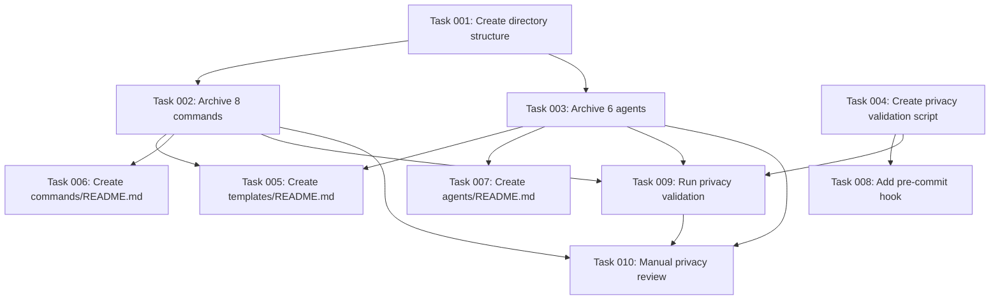

# Implementation Plan: Archive global agents and commands to templates folder

## Overview

**Issue**: #37 - Archive global agents and commands to templates folder
**Milestone**: 0.1.0 - Foundation
**Created**: 2025-10-06
**Estimated Total Complexity**: MEDIUM

**Key Decision from Q&A**: Runtime variable resolution by Claude (no .template extension, keep ${VARS} as-is)

## Task Breakdown

### Task 001: Create directory structure

**Type**: infrastructure
**Agent**: shell-script-specialist
**Complexity**: low
**Dependencies**: []

**Description**:
Create the templates/ directory structure:

- templates/
- templates/commands/
- templates/agents/

**Acceptance Criteria**:

- Directory templates/ exists
- Directory templates/commands/ exists
- Directory templates/agents/ exists

**Files Affected**:

- templates/ (new)
- templates/commands/ (new)
- templates/agents/ (new)

**Implementation Notes**:
Simple mkdir -p command, no complexity

---

### Task 002: Archive 8 core commands to templates/commands/

**Type**: implementation
**Agent**: self  # Claude will handle this directly
**Complexity**: medium
**Dependencies**: ["task-001"]

**Description**:
Copy 8 commands from ~/.claude/commands/ to templates/commands/:

- create-agent.md
- create-command.md
- create-issue.md
- publish-issue.md
- expert-analysis.md
- generate-docs.md
- track-time.md
- workflow-init.md

Keep ${VARS} as-is (no processing needed due to runtime resolution decision).
Replace hardcoded absolute paths with ${PROJECT_ROOT}, ${CLAUDE_CONFIG_DIR}, ${AIDA_HOME}.

**Acceptance Criteria**:

- All 8 command files exist in templates/commands/
- Files contain ${VARS} instead of hardcoded paths
- No .template extension (runtime resolution)
- No privacy violations (usernames, absolute paths with user info)
- YAML frontmatter preserved exactly

**Files Affected**:

- templates/commands/create-agent.md (new)
- templates/commands/create-command.md (new)
- templates/commands/create-issue.md (new)
- templates/commands/publish-issue.md (new)
- templates/commands/expert-analysis.md (new)
- templates/commands/generate-docs.md (new)
- templates/commands/track-time.md (new)
- templates/commands/workflow-init.md (new)

**Implementation Notes**:

- Read each command from ~/.claude/commands/
- Replace /Users/oakensoul/Developer/oakensoul/claude-personal-assistant with ${PROJECT_ROOT}
- Replace ~/.claude with ${CLAUDE_CONFIG_DIR}
- Replace ~/.aida with ${AIDA_HOME}
- Review for any other hardcoded paths or privacy leaks
- Write to templates/commands/

---

### Task 003: Archive 6 core agents to templates/agents/

**Type**: implementation
**Agent**: self
**Complexity**: high
**Dependencies**: ["task-001"]

**Description**:
Archive 6 core agents from ~/.claude/agents/ to templates/agents/:

- claude-agent-manager/
- code-reviewer/
- devops-engineer/
- product-manager/
- tech-lead/
- technical-writer/

For agents with knowledge directories:

- Create genericized knowledge/ content (Q2 decision: scrubbed and genericized)
- Preserve valuable generic patterns
- Remove user-specific learned content
- Use placeholders for examples

**Acceptance Criteria**:

- All 6 core agent directories exist in templates/agents/
- Agent .md files preserved with frontmatter intact
- Knowledge directories have genericized content (not empty, not user-specific)
- No privacy violations (no usernames, no learned patterns from real usage)
- Generic examples using placeholders

**Files Affected**:

- templates/agents/claude-agent-manager/ (new)
- templates/agents/code-reviewer/ (new)
- templates/agents/devops-engineer/ (new)
- templates/agents/product-manager/ (new)
- templates/agents/tech-lead/ (new)
- templates/agents/technical-writer/ (new)

**Implementation Notes**:

- Read each agent .md file
- For agents with knowledge/:
  - Review knowledge content
  - Keep generic patterns (coding standards, best practices)
  - Remove user-specific content (oakensoul, project names, etc.)
  - Genericize examples with placeholders
- Preserve directory structure exactly

---

### Task 004: Create privacy validation script

**Type**: implementation
**Agent**: shell-script-specialist
**Complexity**: medium
**Dependencies**: []

**Description**:
Create scripts/validate-templates.sh to detect privacy violations:

- Scan for absolute paths (/Users/, /home/)
- Detect usernames in content
- Detect PII (emails, phone numbers)
- Validate YAML frontmatter
- Check knowledge/ structure integrity

**Acceptance Criteria**:

- scripts/validate-templates.sh exists
- Script detects /Users/ patterns
- Script detects /home/ patterns
- Script detects email patterns
- Script validates YAML frontmatter
- Script is executable (chmod +x)
- Shellcheck passes

**Files Affected**:

- scripts/validate-templates.sh (new)

**Implementation Notes**:

- Use grep for pattern detection
- Check YAML with basic parsing
- Exit with non-zero on violations
- Clear error messages

---

### Task 005: Create templates/README.md

**Type**: documentation
**Agent**: technical-writer
**Complexity**: medium
**Dependencies**: ["task-002", "task-003"]

**Description**:
Create comprehensive templates/README.md explaining:

- Template system overview
- Variable reference (${PROJECT_ROOT}, ${CLAUDE_CONFIG_DIR}, ${AIDA_HOME})
- Runtime variable resolution by Claude
- Installation process
- How to customize templates

**Acceptance Criteria**:

- templates/README.md exists
- All three variables documented with examples
- Runtime resolution explained clearly
- Installation instructions provided
- Customization workflow documented
- Markdownlint passes

**Files Affected**:

- templates/README.md (new)

**Implementation Notes**:

- Explain runtime variable resolution (key architectural decision)
- Provide examples of ${VARS} usage
- Clear instructions for customization

---

### Task 006: Create templates/commands/README.md

**Type**: documentation
**Agent**: technical-writer
**Complexity**: low
**Dependencies**: ["task-002"]

**Description**:
Create templates/commands/README.md with:

- Command catalog (list of 8 commands)
- Brief description of each command
- Variable usage patterns
- Examples

**Acceptance Criteria**:

- templates/commands/README.md exists
- All 8 commands listed with descriptions
- Variable usage patterns explained
- Markdownlint passes

**Files Affected**:

- templates/commands/README.md (new)

**Implementation Notes**:

- Brief catalog format
- Focus on discoverability

---

### Task 007: Create templates/agents/README.md

**Type**: documentation
**Agent**: technical-writer
**Complexity**: low
**Dependencies**: ["task-003"]

**Description**:
Create templates/agents/README.md with:

- Agent structure explanation
- Core agents catalog (list of 6 agents)
- Knowledge directory organization
- Categories (core vs specialized)

**Acceptance Criteria**:

- templates/agents/README.md exists
- All 6 core agents listed with descriptions
- Knowledge directory structure explained
- Categories documented
- Markdownlint passes

**Files Affected**:

- templates/agents/README.md (new)

**Implementation Notes**:

- Explain agent structure
- Document knowledge/ organization
- Note that specialized agents are Phase 2

---

### Task 008: Add pre-commit hook for template validation

**Type**: configuration
**Agent**: devops-engineer
**Complexity**: low
**Dependencies**: ["task-004"]

**Description**:
Add pre-commit hook to .pre-commit-config.yaml:

- Hook to run scripts/validate-templates.sh on templates/
- Block commits with privacy violations

**Acceptance Criteria**:

- .pre-commit-config.yaml updated
- Hook triggers on templates/ changes
- Hook runs validation script
- Pre-commit run passes

**Files Affected**:

- .pre-commit-config.yaml (modified)

**Implementation Notes**:

- Add local hook
- Use files: ^templates/
- Entry points to validation script

---

### Task 009: Run privacy validation on all templates

**Type**: testing
**Agent**: qa-engineer
**Complexity**: low
**Dependencies**: ["task-002", "task-003", "task-004"]

**Description**:
Run scripts/validate-templates.sh on all templates to verify:

- No privacy violations
- No hardcoded paths
- No usernames
- All YAML valid

**Acceptance Criteria**:

- scripts/validate-templates.sh exits 0
- No violations detected
- Manual review confirms results

**Files Affected**:

- (validation only, no file changes)

**Implementation Notes**:

- Run validation script
- Review any violations
- Fix if needed
- Re-run until clean

---

### Task 010: Manual privacy review

**Type**: quality
**Agent**: self
**Complexity**: medium
**Dependencies**: ["task-002", "task-003", "task-009"]

**Description**:
Manual review of all templates for privacy:

- Review knowledge/ content for user-specific patterns
- Check examples for real data
- Verify all paths use ${VARS}
- Confirm no PII present

**Acceptance Criteria**:

- All 8 commands reviewed
- All 6 agents reviewed
- Knowledge content genericized
- No privacy concerns identified

**Files Affected**:

- (review only, potential fixes)

**Implementation Notes**:

- Thorough manual inspection
- When in doubt, genericize or remove
- Better to over-scrub than leak data

---

## Task Dependencies Graph

## Agent Allocation

**self (Claude)**: 3 tasks (002, 003, 010)
**shell-script-specialist**: 2 tasks (001, 004)
**technical-writer**: 3 tasks (005, 006, 007)
**devops-engineer**: 1 task (008)
**qa-engineer**: 1 task (009)

## Risk Assessment

**High-Risk Tasks**:

- Task 002: Command archival - Risk: Privacy leak from hardcoded paths
- Task 003: Agent archival - Risk: Learned patterns leak user data
- Task 010: Manual review - Risk: Missing subtle privacy violations

**Mitigation Strategies**:

- Automated validation script (Task 004)
- Manual review pass (Task 010)
- Pre-commit hook blocking (Task 008)
- Conservative approach: when in doubt, genericize

## Estimated Timeline

**Total Tasks**: 10
**Low Complexity**: 5 tasks (~1 hour each = 5 hours)
**Medium Complexity**: 4 tasks (~2 hours each = 8 hours)
**High Complexity**: 1 task (~4 hours = 4 hours)

**Total Estimated Time**: 17 hours

**Breakdown by Phase**:

1. Infrastructure (Task 001): 1 hour
2. Core archival (Tasks 002-003): 6 hours
3. Validation (Tasks 004, 009): 3 hours
4. Documentation (Tasks 005-007): 5 hours
5. Integration (Task 008): 1 hour
6. Final review (Task 010): 2 hours
