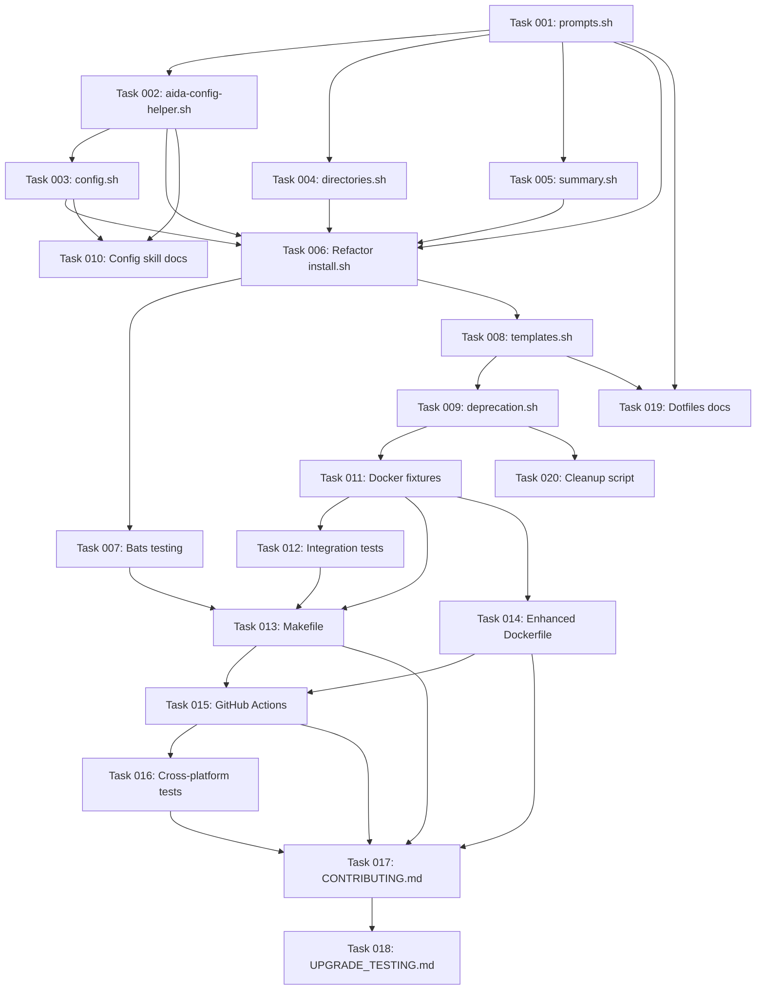

# Implementation Plan: Modular Installer with Deprecation Support

## Overview

**Issue**: #53 - Modular installer with deprecation support and .aida namespace installation
**Milestone**: v0.2.0
**Created**: 2025-10-18
**Estimated Total Complexity**: HIGH (85-98 hours)

## Architectural Foundation

This implementation is governed by three foundational ADRs:

- **ADR-011**: Modular Installer Architecture
- **ADR-012**: Universal Config Aggregator Pattern
- **ADR-013**: Namespace Isolation for User Content Protection

See [TECH_SPEC.md](./TECH_SPEC.md) for complete specifications and [Architecture Summary](./architecture/ARCHITECTURE_SUMMARY.md) for comprehensive overview.

---

## Phase 1: Foundation (20 hours)

### Task 001: Extract `prompts.sh` module

**Type**: refactoring
**Agent**: shell-script-specialist
**Complexity**: LOW
**Dependencies**: None
**Estimated Time**: 3 hours

**Description**:
Extract all user interaction and prompt logic from install.sh into reusable `lib/installer-common/prompts.sh` module.

**Acceptance Criteria**:
- New file `lib/installer-common/prompts.sh` exists
- All prompt functions accept parameters (no globals)
- Functions include: `prompt_yes_no`, `prompt_input`, `prompt_select`, `confirm_action`
- All prompts include clear messaging and validation
- Module passes shellcheck with zero warnings
- Install.sh sources and uses new module
- All existing prompts work identically
- Unit tests created for prompt validation logic

**Files Affected**:
- `lib/installer-common/prompts.sh` (new)
- `install.sh` (refactored)
- `tests/unit/prompts.bats` (new)

---

### Task 002: Create universal config aggregator `aida-config-helper.sh`

**Type**: implementation
**Agent**: shell-script-specialist
**Complexity**: MEDIUM
**Dependencies**: Task 001
**Estimated Time**: 8 hours

**Description**:
Implement universal config aggregator that merges 7 config sources with session caching and checksum-based invalidation.

**Acceptance Criteria**:
- New file `lib/aida-config-helper.sh` exists (standalone executable)
- Merges configs in priority order: Env → Project → Workflow → GitHub → Git → User → System
- Session caching with `/tmp/aida-config-cache-$$`
- Checksum-based cache invalidation (platform-safe: BSD/GNU stat)
- Supports CLI args: `--key`, `--namespace`, `--format yaml`, `--validate`
- Returns valid JSON structure matching TECH_SPEC schema
- Handles missing config files gracefully (no errors)
- Passes shellcheck and unit tests
- Performance: <100ms for cached calls, <500ms for uncached

**Files Affected**:
- `lib/aida-config-helper.sh` (new)
- `tests/unit/config-aggregator.bats` (new)
- `tests/fixtures/configs/` (new test fixtures)

---

### Task 003: Extract `config.sh` wrapper module

**Type**: implementation
**Agent**: shell-script-specialist
**Complexity**: LOW
**Dependencies**: Task 002
**Estimated Time**: 2 hours

**Description**:
Create wrapper module in lib/installer-common/ that provides convenient functions for install.sh to use aida-config-helper.sh.

**Acceptance Criteria**:
- New file `lib/installer-common/config.sh` exists
- Provides functions: `get_config`, `get_config_value`, `write_user_config`
- Sources and uses `aida-config-helper.sh`
- Handles config creation during installation
- Validates required config keys exist
- Unit tests for wrapper functions

**Files Affected**:
- `lib/installer-common/config.sh` (new)
- `tests/unit/config.bats` (new)

---

### Task 004: Extract `directories.sh` module

**Type**: refactoring
**Agent**: shell-script-specialist
**Complexity**: MEDIUM
**Dependencies**: Task 001
**Estimated Time**: 5 hours

**Description**:
Extract all directory creation, symlink management, and backup operations into reusable module.

**Acceptance Criteria**:
- New file `lib/installer-common/directories.sh` exists
- Functions: `create_aida_dir`, `create_claude_dirs`, `create_namespace_dirs`, `backup_existing`, `create_symlink`
- All functions accept parameters (no hardcoded paths)
- Cross-platform symlink handling (BSD/GNU readlink)
- Symlink validation and broken link detection
- Idempotent operations (safe to re-run)
- Passes shellcheck and unit tests

**Files Affected**:
- `lib/installer-common/directories.sh` (new)
- `install.sh` (refactored)
- `tests/unit/directories.bats` (new)

---

### Task 005: Extract `summary.sh` module

**Type**: refactoring
**Agent**: shell-script-specialist
**Complexity**: LOW
**Dependencies**: Task 001
**Estimated Time**: 2 hours

**Description**:
Extract installation summary display logic into dedicated module for consistent UX.

**Acceptance Criteria**:
- New file `lib/installer-common/summary.sh` exists
- Functions: `display_summary`, `display_next_steps`, `display_success`, `display_error`
- Uses colors.sh for formatting
- Clear, helpful messaging
- Passes shellcheck

**Files Affected**:
- `lib/installer-common/summary.sh` (new)
- `install.sh` (refactored)

---

### Task 006: Refactor `install.sh` to orchestrator

**Type**: refactoring
**Agent**: shell-script-specialist
**Complexity**: MEDIUM
**Dependencies**: Tasks 001-005
**Estimated Time**: 4 hours

**Description**:
Refactor install.sh from 625-line monolith to ~150-line orchestrator that sources and uses all library modules.

**Acceptance Criteria**:
- install.sh reduced to ~150 lines
- Sources all new modules from lib/installer-common/
- No embedded business logic (all in modules)
- Main flow: parse args → validate → create dirs → install templates → display summary
- All existing functionality preserved
- Passes shellcheck
- Installation smoke test passes

**Files Affected**:
- `install.sh` (major refactoring)

---

### Task 007: Setup bats unit testing framework

**Type**: testing
**Agent**: qa-engineer
**Complexity**: LOW
**Dependencies**: Tasks 001-006
**Estimated Time**: 2 hours

**Description**:
Setup bats (Bash Automated Testing System) for unit testing all library modules.

**Acceptance Criteria**:
- bats installed or documented how to install
- Test directory structure created: `tests/unit/`, `tests/fixtures/`
- Makefile target: `make test-unit`
- All unit tests pass
- README documentation for running tests

**Files Affected**:
- `tests/unit/*.bats` (test files from previous tasks)
- `Makefile` (new test target)
- `docs/testing/UNIT_TESTING.md` (new)

---

## Phase 2: Advanced Features (20 hours)

### Task 008: Implement `templates.sh` with namespace isolation

**Type**: implementation
**Agent**: shell-script-specialist
**Complexity**: HIGH
**Dependencies**: Tasks 001-006
**Estimated Time**: 8 hours

**Description**:
Implement template installation logic with `.aida/` namespace isolation, supporting both normal and dev modes.

**Acceptance Criteria**:
- New file `lib/installer-common/templates.sh` exists
- Functions: `install_templates`, `install_template_folder`
- Supports normal mode (copy templates)
- Supports dev mode (symlink templates)
- Installs to `.aida/` subdirectories (NOT root ~/.claude/)
- NO variable substitution (templates stay pure, use config helper at runtime)
- Preserves user content outside `.aida/` namespace
- Handles both folder-based and file-based templates
- Passes shellcheck and integration tests

**Files Affected**:
- `lib/installer-common/templates.sh` (new)
- `tests/integration/template-installation.bats` (new)

---

### Task 009: Implement `deprecation.sh` with version logic

**Type**: implementation
**Agent**: shell-script-specialist
**Complexity**: HIGH
**Dependencies**: Task 008
**Estimated Time**: 6 hours

**Description**:
Implement version-based deprecation system with frontmatter parsing and semantic version comparison.

**Acceptance Criteria**:
- New file `lib/installer-common/deprecation.sh` exists
- Functions: `parse_frontmatter`, `is_deprecated`, `compare_versions`, `should_remove`
- Pure Bash frontmatter parsing (no yq/python dependencies)
- Semantic version comparison (MAJOR.MINOR.PATCH)
- Supports `--with-deprecated` flag
- Installs deprecated templates to `.aida-deprecated/` namespace
- Passes shellcheck and unit tests

**Files Affected**:
- `lib/installer-common/deprecation.sh` (new)
- `tests/unit/deprecation.bats` (new)
- `tests/fixtures/templates-deprecated/` (new)

---

### Task 010: Create AIDA config skill documentation

**Type**: documentation
**Agent**: technical-writer
**Complexity**: LOW
**Dependencies**: Tasks 002-003
**Estimated Time**: 1 hour

**Description**:
Create skill documentation for aida-config skill that all agents can use for config reading.

**Acceptance Criteria**:
- New file `templates/skills/.aida/aida-config/README.md` exists
- Documents usage patterns for agents
- Includes examples of reading config values
- Explains caching and performance benefits
- Cross-references aida-config-helper.sh

**Files Affected**:
- `templates/skills/.aida/aida-config/README.md` (new)

---

### Task 011: Create Docker test fixtures

**Type**: testing
**Agent**: qa-engineer
**Complexity**: MEDIUM
**Dependencies**: Tasks 008-009
**Estimated Time**: 3 hours

**Description**:
Create Docker test fixtures simulating various installation scenarios for upgrade testing.

**Acceptance Criteria**:
- Fixtures in `.github/testing/fixtures/`
- Simulated v0.1.x AIDA installation
- User-created custom commands/agents/skills
- Deprecated template examples
- Upgrade scenario configurations
- README documenting fixture structure

**Files Affected**:
- `.github/testing/fixtures/user-content/` (new)
- `.github/testing/fixtures/v0.1-installation/` (new)
- `.github/testing/fixtures/README.md` (new)

---

### Task 012: Create integration tests for upgrade scenarios

**Type**: testing
**Agent**: qa-engineer
**Complexity**: MEDIUM
**Dependencies**: Task 011
**Estimated Time**: 3 hours

**Description**:
Create comprehensive integration tests validating user content preservation during upgrades.

**Acceptance Criteria**:
- Test: Fresh installation on clean system
- Test: Upgrade with existing user content (preserved)
- Test: Dev mode symlink creation and validation
- Test: Deprecated template installation
- Test: Config aggregator merges all sources correctly
- Test: Normal vs dev mode behavioral differences
- All tests pass in Docker environment

**Files Affected**:
- `tests/integration/upgrade-scenarios.bats` (new)
- `.github/testing/test-upgrade.sh` (new)

---

## Phase 3: CI/CD & Documentation (15 hours)

### Task 013: Create Makefile with test orchestration

**Type**: infrastructure
**Agent**: devops-engineer
**Complexity**: LOW
**Dependencies**: Tasks 007, 011-012
**Estimated Time**: 2-3 hours

**Description**:
Create Makefile providing intuitive test targets for all testing scenarios.

**Acceptance Criteria**:
- Targets: `test-unit`, `test-integration`, `test-install`, `test-upgrade`, `test-all`
- Parameterized: `VERBOSE=1`, `ENVIRONMENT=ubuntu-22`
- Self-documenting: `make help`
- Works on macOS and Linux
- README documentation

**Files Affected**:
- `Makefile` (enhanced)
- `docs/testing/MAKEFILE_GUIDE.md` (new)

---

### Task 014: Create enhanced Dockerfile for upgrade testing

**Type**: infrastructure
**Agent**: devops-engineer
**Complexity**: MEDIUM
**Dependencies**: Task 011
**Estimated Time**: 4-6 hours

**Description**:
Create Docker environments with pre-seeded fixtures for realistic upgrade testing.

**Acceptance Criteria**:
- Dockerfile in `.github/testing/Dockerfile`
- Pre-seeds v0.1.x AIDA installation
- Includes user-created content
- Volume mount strategy for testing
- Support for ubuntu-22, ubuntu-20, debian-12
- Build and run instructions

**Files Affected**:
- `.github/testing/Dockerfile` (new)
- `.github/testing/docker-compose.yml` (new)
- `.github/testing/README.md` (updated)

---

### Task 015: Update GitHub Actions workflow for comprehensive testing

**Type**: infrastructure
**Agent**: devops-engineer
**Complexity**: MEDIUM
**Dependencies**: Tasks 013-014
**Estimated Time**: 4-6 hours

**Description**:
Extend GitHub Actions workflow to test all installation modes across platforms.

**Acceptance Criteria**:
- Test matrix: Ubuntu 22/20, Debian 12, macOS latest
- Test modes: normal, dev, with-deprecated
- Test scenarios: fresh, upgrade, mode-switch
- Performance benchmarking (installation time)
- ShellCheck linting on all shell scripts
- YAML frontmatter validation
- Test results summary in PR comments (optional)

**Files Affected**:
- `.github/workflows/test-installer.yml` (new)
- `.github/workflows/ci.yml` (updated)

---

### Task 016: Cross-platform validation testing

**Type**: testing
**Agent**: qa-engineer
**Complexity**: MEDIUM
**Dependencies**: Task 015
**Estimated Time**: 3-4 hours

**Description**:
Manual validation of installation across macOS, Linux, and Windows WSL.

**Acceptance Criteria**:
- Fresh install tested on macOS (latest)
- Fresh install tested on Ubuntu LTS (current)
- Upgrade install tested on macOS
- Upgrade install tested on Ubuntu
- Dev mode tested on macOS and Linux
- Platform-specific edge cases documented
- Test results documented

**Files Affected**:
- `docs/testing/PLATFORM_TESTING.md` (new)

---

### Task 017: Update CONTRIBUTING.md with testing guide

**Type**: documentation
**Agent**: technical-writer
**Complexity**: LOW
**Dependencies**: Tasks 013-016
**Estimated Time**: 1-2 hours

**Description**:
Update CONTRIBUTING.md with comprehensive testing guide for contributors.

**Acceptance Criteria**:
- Documents how to run all test types
- Explains Docker testing workflow
- Describes CI/CD pipeline
- Includes troubleshooting section
- Cross-references other testing docs

**Files Affected**:
- `docs/CONTRIBUTING.md` (updated)

---

### Task 018: Create UPGRADE_TESTING.md documentation

**Type**: documentation
**Agent**: technical-writer
**Complexity**: LOW
**Dependencies**: Task 017
**Estimated Time**: 1 hour

**Description**:
Create detailed guide for upgrade testing scenarios and validation procedures.

**Acceptance Criteria**:
- Documents all upgrade scenarios
- Explains fixture structure
- Includes validation checklists
- Troubleshooting for common issues

**Files Affected**:
- `docs/testing/UPGRADE_TESTING.md` (new)

---

### Task 019: Create dotfiles integration documentation

**Type**: documentation
**Agent**: technical-writer
**Complexity**: LOW
**Dependencies**: Tasks 001-009
**Estimated Time**: 1-2 hours

**Description**:
Document how dotfiles repo can source and use lib/installer-common/ libraries.

**Acceptance Criteria**:
- Documents API contract for libraries
- Includes example integration code
- Explains version compatibility checking
- Covers graceful degradation scenarios

**Files Affected**:
- `docs/integrations/DOTFILES.md` (updated)

---

### Task 020: Create automated cleanup script for deprecated templates

**Type**: implementation
**Agent**: shell-script-specialist
**Complexity**: MEDIUM
**Dependencies**: Task 009
**Estimated Time**: 3 hours

**Description**:
Create script that automatically removes deprecated templates based on version comparison.

**Acceptance Criteria**:
- New file `scripts/cleanup-deprecated.sh`
- Reads VERSION file
- Scans templates/*-deprecated/ folders
- Removes items where current_version >= remove_in
- Dry-run mode with `--dry-run` flag
- Passes shellcheck

**Files Affected**:
- `scripts/cleanup-deprecated.sh` (new)
- `docs/MAINTENANCE.md` (updated)

---

## Task Dependencies Graph

---

## Agent Allocation

**shell-script-specialist**: 10 tasks (T001-T006, T008-T009, T020)
- Prompts module extraction
- Config aggregator implementation
- Config wrapper module
- Directories module extraction
- Summary module extraction
- install.sh refactoring
- Templates implementation
- Deprecation implementation
- Cleanup script

**qa-engineer**: 5 tasks (T007, T011-T012, T016)
- Bats setup
- Docker fixtures
- Integration tests
- Cross-platform validation

**devops-engineer**: 3 tasks (T013-T015)
- Makefile creation
- Enhanced Dockerfile
- GitHub Actions workflow

**technical-writer**: 4 tasks (T010, T017-T019)
- Config skill docs
- CONTRIBUTING.md
- UPGRADE_TESTING.md
- Dotfiles integration docs

---

## Risk Assessment

### High-Risk Tasks

**Task 002: Universal config aggregator** 🔴
- Reason: Core architecture change affecting all commands
- Mitigation: Comprehensive unit tests, gradual rollout, fallback strategy

**Task 008: Templates with namespace isolation** 🔴
- Reason: Critical for user data protection
- Mitigation: Extensive integration tests with user content preservation validation

**Task 009: Deprecation system** 🟠
- Reason: Complex version comparison logic
- Mitigation: Thorough unit tests, multiple test fixtures

**Task 015: GitHub Actions workflow** 🟠
- Reason: Complex matrix testing across platforms
- Mitigation: Incremental implementation, manual validation before automation

---

## Estimated Timeline

| Phase | Tasks | Low Est. | High Est. | Recommended |
|-------|-------|----------|-----------|-------------|
| **Phase 1: Foundation** | T001-T007 | 20h | 24h | 24h |
| **Phase 2: Advanced** | T008-T012 | 20h | 24h | 24h |
| **Phase 3: CI/CD & Docs** | T013-T020 | 15h | 20h | 20h |
| **TOTAL** | 20 tasks | **55h** | **68h** | **68h** |

**With 20% buffer**: 82 hours
**Timeline**: ~10-11 days (assuming 8h/day, single developer)
**Recommended**: 3 weeks with buffer for testing and validation

---

## Success Criteria

### Must Have (Blocking Release)

1. ✅ install.sh reduced to ~150 lines (all logic in lib modules)
2. ✅ All 6 new modules implemented and tested
3. ✅ Universal config aggregator working with caching
4. ✅ Namespace isolation working (.aida/ subdirectories)
5. ✅ User content preserved during all test scenarios
6. ✅ All unit tests passing
7. ✅ All integration tests passing
8. ✅ Docker tests passing on Linux
9. ✅ GitHub Actions tests passing on all platforms
10. ✅ Documentation complete

### Should Have (Important)

11. ✅ Config aggregator achieves 85%+ I/O reduction
12. ✅ Dev mode symlinks working correctly
13. ✅ Deprecation system functional end-to-end
14. ✅ Cross-platform manual validation complete
15. ✅ Makefile intuitive and documented

### Nice to Have (Defer if Needed)

16. ❌ PR comment test reporter
17. ❌ Windows container tests (WSL manual tests sufficient)
18. ❌ Installation time estimates in output
19. ❌ Rollback capability

---

## Implementation Notes

### Open Questions - RESOLVED

All three critical open questions from PRD have been resolved:

**Q1: Dev mode variable substitution** → RESOLVED
- **Decision**: Universal config aggregator (user's innovation!)
- **Approach**: No variable substitution needed - templates stay pure, use `aida-config-helper.sh` at runtime
- **Impact**: Massively simplified, 85%+ I/O reduction

**Q2: Deprecation blocking** → RESOLVED
- **Decision**: "Warn and Skip"
- **Behavior**: Warn user if deprecated templates conflict, skip installation of deprecated, continue with non-deprecated

**Q3: Version compatibility** → RESOLVED
- **Decision**: "Hard Fail"
- **Behavior**: If dotfiles requires lib v0.2.0 but installed is v0.1.9, fail with clear error message

### Key Architectural Decisions

1. **Always symlink ~/.aida/**
   - Both normal and dev mode symlink framework to repo
   - Enables `git pull` updates in both modes
   - Only difference: template installation (copy vs symlink)

2. **No variable substitution in templates**
   - Templates stay pure (keep `{{VAR}}` patterns)
   - Runtime resolution via `aida-config-helper.sh`
   - Simpler, more maintainable

3. **Universal config aggregator**
   - Single source of truth for ALL configs
   - 7-tier priority resolution
   - Session caching with checksum invalidation
   - 85%+ I/O reduction across all commands

4. **Namespace isolation**
   - AIDA templates in `.aida/` subdirectories
   - User content in parent directories
   - Zero data loss guarantee

---

## Related Documents

- **PRD**: `.github/issues/in-progress/issue-53/PRD.md`
- **Technical Spec**: `.github/issues/in-progress/issue-53/TECH_SPEC.md`
- **Implementation Summary**: `.github/issues/in-progress/issue-53/IMPLEMENTATION_SUMMARY.md`
- **ADRs**: `docs/architecture/decisions/adr-011.md`, `adr-012.md`, `adr-013.md`
- **C4 Diagrams**: `docs/architecture/diagrams/c4-*.md`

---

**Created**: 2025-10-18T18:00:00Z
**Status**: Pending approval
**Next Step**: Review plan and begin Phase 1 implementation
