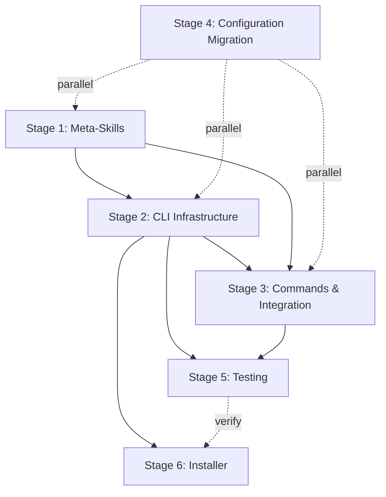

# Implementation Plan: Discoverability Commands

## Overview

**Issue**: #54 - Implement discoverability commands (/agent-list, /skill-list, /command-list)
**Milestone**: 0.1.0
**Branch**: milestone-v0.1/feature/54-implement-discoverability-commands
**Total Estimated Time**: 59-85 hours (7.5-10.5 days)

Breaking Phase 1 into 6 manageable stages for incremental implementation.

---

## Stage 1: Foundation - AIDA Meta-Skills ⭐ PRIORITY

**Estimated**: 18-24 hours (2-3 days)
**Status**: Pending
**Dependencies**: None

### Why First?

These meta-skills are the foundation that everything else builds on. They provide comprehensive knowledge about AIDA's object model that commands and agents will use.

### Tasks

#### Task 1.1: Create aida-agents Meta-Skill

- **File**: `templates/skills/aida-agents/aida-agents.md`
- **Effort**: 6-8 hours
- **Agent**: technical-writer (or direct implementation)
- **Description**: Create comprehensive skill document about agent architecture
- **Content**:
  - Agent file structure (`~/.claude/agents/{agent}/{agent}.md`)
  - Frontmatter schema (name, description, version, model, etc.)
  - Two-tier architecture (user + project levels)
  - Knowledge base organization
  - How to create new agents
  - How to update existing agents
  - Validation requirements
  - Integration with `list-agents.sh`
- **Acceptance Criteria**:
  - [ ] File created with proper frontmatter
  - [ ] All agent patterns documented
  - [ ] Examples provided
  - [ ] Schema definitions clear
  - [ ] Passes markdown linting

#### Task 1.2: Create aida-skills Meta-Skill

- **File**: `templates/skills/aida-skills/aida-skills.md`
- **Effort**: 6-8 hours
- **Agent**: technical-writer (or direct implementation)
- **Description**: Create comprehensive skill document about skill architecture
- **Content**:
  - Skill file structure (`~/.claude/skills/{category}/{skill}/{skill}.md`)
  - Frontmatter schema
  - 28 skill categories
  - How to create new skills
  - How to update existing skills
  - How agents "use" skills
  - Validation requirements
  - Integration with `list-skills.sh`
- **Acceptance Criteria**:
  - [ ] File created with proper frontmatter
  - [ ] All skill patterns documented
  - [ ] Category taxonomy included
  - [ ] Examples provided
  - [ ] Passes markdown linting

#### Task 1.3: Create aida-commands Meta-Skill

- **File**: `templates/skills/aida-commands/aida-commands.md`
- **Effort**: 6-8 hours
- **Agent**: technical-writer (or direct implementation)
- **Description**: Create comprehensive skill document about command architecture
- **Content**:
  - Command file structure (`~/.claude/commands/.aida/{command}/{command}.md`)
  - Frontmatter schema (name, description, version, category, args)
  - 8 command categories (workflow, quality, security, operations, infrastructure, data, documentation, meta)
  - How to create new commands
  - How to update existing commands
  - Argument handling patterns
  - Validation requirements
  - Integration with `list-commands.sh`
- **Acceptance Criteria**:
  - [ ] File created with proper frontmatter
  - [ ] All command patterns documented
  - [ ] Category taxonomy documented
  - [ ] Argument patterns explained
  - [ ] Examples provided
  - [ ] Passes markdown linting

### Stage 1 Completion Criteria

- [ ] All three meta-skills created
- [ ] Each passes markdown linting
- [ ] Content comprehensive and accurate
- [ ] Ready to be referenced by CLI scripts and commands

---

## Stage 2: CLI Infrastructure - Scripts & Libraries

**Estimated**: 24-34 hours (3-4 days)
**Status**: Pending
**Dependencies**: Stage 1 (meta-skills for reference)

### Tasks

#### Task 2.1: Create Shared Library - Frontmatter Parser

- **File**: `scripts/lib/frontmatter-parser.sh`
- **Effort**: 2-3 hours
- **Agent**: shell-script-specialist
- **Description**: Create bash library for parsing YAML frontmatter using sed/awk
- **Functions**:
  - `extract_frontmatter()` - Extract YAML between --- markers
  - `get_field()` - Get specific field value from frontmatter
  - `validate_frontmatter()` - Check structure is valid
- **Acceptance Criteria**:
  - [ ] File created with proper header
  - [ ] All functions implemented
  - [ ] Handles edge cases (quotes, colons, multiline)
  - [ ] 4KB size limit enforced
  - [ ] Passes shellcheck
  - [ ] Unit tests pass (if created)

#### Task 2.2: Create Shared Library - Path Sanitizer

- **File**: `scripts/lib/path-sanitizer.sh`
- **Effort**: 1-2 hours
- **Agent**: shell-script-specialist
- **Description**: Create bash library for sanitizing absolute paths
- **Functions**:
  - `sanitize_path()` - Replace absolute paths with variables
  - Variables: `${CLAUDE_CONFIG_DIR}`, `${AIDA_HOME}`, `${PROJECT_ROOT}`, `${HOME}`
- **Acceptance Criteria**:
  - [ ] File created with proper header
  - [ ] All functions implemented
  - [ ] Handles nested paths correctly
  - [ ] Most specific replacements first
  - [ ] Passes shellcheck

#### Task 2.3: Create Shared Library - Portable Readlink

- **File**: `scripts/lib/readlink-portable.sh`
- **Effort**: 1 hour
- **Agent**: shell-script-specialist
- **Description**: Cross-platform symlink resolution (macOS + Linux)
- **Functions**:
  - `readlink_portable()` - Resolve symlinks with fallback
  - Detects `readlink -f` or `greadlink` or Python fallback
- **Acceptance Criteria**:
  - [ ] File created with proper header
  - [ ] Works on macOS (without GNU readlink)
  - [ ] Works on Linux (with GNU readlink)
  - [ ] Python fallback functional
  - [ ] Passes shellcheck

#### Task 2.4: Create Shared Library - JSON Formatter

- **File**: `scripts/lib/json-formatter.sh`
- **Effort**: 2-3 hours
- **Agent**: shell-script-specialist
- **Description**: Format output as JSON for `--format json` option
- **Functions**:
  - `format_json_array()` - Create JSON array from items
  - `escape_json_string()` - Properly escape JSON strings
  - `build_json_object()` - Build JSON objects
- **Acceptance Criteria**:
  - [ ] File created with proper header
  - [ ] All functions implemented
  - [ ] Valid JSON output
  - [ ] Handles special characters
  - [ ] Passes shellcheck

#### Task 2.5: Create CLI Script - list-agents.sh

- **File**: `scripts/list-agents.sh`
- **Effort**: 4-6 hours
- **Agent**: shell-script-specialist
- **Description**: Scan and list agents from user + project levels
- **Features**:
  - Two-tier scanning (`~/.claude/agents/` + `./.claude/agents/`)
  - Symlink deduplication using `readlink_portable()`
  - Path sanitization
  - Plain text table output (default)
  - JSON output (`--format json`)
  - Version display
  - Global vs project section separation
- **Acceptance Criteria**:
  - [ ] File created with proper shebang and header
  - [ ] Sources shared libraries
  - [ ] Two-tier scanning works
  - [ ] Deduplicates symlinks correctly
  - [ ] Plain text output formatted
  - [ ] JSON output valid
  - [ ] Version field displayed
  - [ ] <500ms execution time
  - [ ] Passes shellcheck

#### Task 2.6: Create CLI Script - list-skills.sh

- **File**: `scripts/list-skills.sh`
- **Effort**: 6-10 hours
- **Agent**: shell-script-specialist
- **Description**: Scan and list skills with category-first approach
- **Features**:
  - Two-tier scanning (`~/.claude/skills/` + `./.claude/skills/`)
  - Category-first display (show categories by default)
  - `<category>` argument shows skills within category
  - Symlink deduplication
  - Path sanitization
  - Plain text + JSON output
  - Progressive disclosure (177 skills, 28 categories)
- **Acceptance Criteria**:
  - [ ] File created with proper shebang and header
  - [ ] Sources shared libraries
  - [ ] Two-tier scanning works
  - [ ] Category-first display
  - [ ] Argument parsing for category filter
  - [ ] Plain text output formatted
  - [ ] JSON output valid
  - [ ] <1s execution time
  - [ ] Passes shellcheck

#### Task 2.7: Create CLI Script - list-commands.sh

- **File**: `scripts/list-commands.sh`
- **Effort**: 8-12 hours
- **Agent**: shell-script-specialist
- **Description**: Scan and list commands with category filtering
- **Features**:
  - Two-tier scanning (`~/.claude/commands/` + `./.claude/commands/`)
  - `--category <name>` optional filtering
  - Category validation (8 categories)
  - Symlink deduplication
  - Path sanitization
  - Plain text + JSON output
  - Grouped by category display
- **Acceptance Criteria**:
  - [ ] File created with proper shebang and header
  - [ ] Sources shared libraries
  - [ ] Two-tier scanning works
  - [ ] `--category` argument parsing
  - [ ] Category validation
  - [ ] Plain text output formatted
  - [ ] JSON output valid
  - [ ] <500ms execution time
  - [ ] Passes shellcheck

### Stage 2 Completion Criteria

- [ ] All 4 shared libraries created and pass shellcheck
- [ ] All 3 CLI scripts created and pass shellcheck
- [ ] Scripts executable (`chmod +x`)
- [ ] Performance targets met
- [ ] Cross-platform compatibility verified

---

## Stage 3: Commands & Agent Integration

**Estimated**: 3-4 hours
**Status**: Pending
**Dependencies**: Stage 1 (meta-skills), Stage 2 (CLI scripts)

### Tasks

#### Task 3.1: Create /agent-list Command

- **File**: `templates/commands/.aida/agent-list/agent-list.md`
- **Effort**: 30 min
- **Agent**: Direct implementation
- **Description**: Slash command that delegates to claude-agent-manager with aida-agents skill
- **Content**:
  - Frontmatter (name, description, version, category: meta)
  - Instructions to invoke claude-agent-manager
  - Reference aida-agents skill
  - Invoke `scripts/list-agents.sh`
  - Format and present results
- **Acceptance Criteria**:
  - [ ] File created with proper frontmatter
  - [ ] Delegates to agent correctly
  - [ ] References aida-agents skill
  - [ ] Script invocation documented
  - [ ] Passes markdown linting

#### Task 3.2: Create /skill-list Command

- **File**: `templates/commands/.aida/skill-list/skill-list.md`
- **Effort**: 30 min
- **Agent**: Direct implementation
- **Description**: Slash command that delegates to claude-agent-manager with aida-skills skill
- **Content**:
  - Frontmatter (name, description, version, category: meta)
  - Instructions to invoke claude-agent-manager
  - Reference aida-skills skill
  - Invoke `scripts/list-skills.sh`
  - Support optional category argument
  - Format and present results
- **Acceptance Criteria**:
  - [ ] File created with proper frontmatter
  - [ ] Delegates to agent correctly
  - [ ] References aida-skills skill
  - [ ] Argument passing documented
  - [ ] Passes markdown linting

#### Task 3.3: Create /command-list Command

- **File**: `templates/commands/.aida/command-list/command-list.md`
- **Effort**: 30 min
- **Agent**: Direct implementation
- **Description**: Slash command that delegates to claude-agent-manager with aida-commands skill
- **Content**:
  - Frontmatter (name, description, version, category: meta)
  - Instructions to invoke claude-agent-manager
  - Reference aida-commands skill
  - Invoke `scripts/list-commands.sh`
  - Support optional `--category` argument
  - Format and present results
- **Acceptance Criteria**:
  - [ ] File created with proper frontmatter
  - [ ] Delegates to agent correctly
  - [ ] References aida-commands skill
  - [ ] Argument passing documented
  - [ ] Passes markdown linting

#### Task 3.4: Update claude-agent-manager Configuration

- **File**: `~/.claude/agents/claude-agent-manager/claude-agent-manager.md` (or project equivalent)
- **Effort**: 1 hour
- **Agent**: Direct implementation
- **Description**: Add three meta-skills to agent configuration
- **Changes**:
  - Add aida-agents to skills list
  - Add aida-skills to skills list
  - Add aida-commands to skills list
  - Document skill purposes
- **Acceptance Criteria**:
  - [ ] Agent file updated
  - [ ] Three skills added
  - [ ] Skills properly documented
  - [ ] Passes markdown linting

#### Task 3.5: Test Command Invocation

- **Effort**: 1 hour
- **Agent**: Direct testing
- **Description**: Verify commands invoke agent with skills correctly
- **Tests**:
  - Test `/agent-list` invokes correctly
  - Test `/skill-list` invokes correctly
  - Test `/command-list` invokes correctly
  - Verify skills are accessible to agent
  - Verify scripts execute from commands
- **Acceptance Criteria**:
  - [ ] All three commands execute
  - [ ] Agent receives skill context
  - [ ] Scripts run successfully
  - [ ] Output formatted correctly

### Stage 3 Completion Criteria

- [ ] All three commands created
- [ ] Agent configuration updated
- [ ] Commands successfully invoke agent + skills + scripts
- [ ] End-to-end flow verified

---

## Stage 4: Configuration Migration

**Estimated**: 4-5 hours
**Status**: Pending
**Dependencies**: None (can run in parallel with other stages)

### Tasks

#### Task 4.1: Add Category & Version to Existing Commands

- **Files**: 32 command files in `templates/commands/`
- **Effort**: 3-4 hours
- **Agent**: configuration-specialist (or batch script)
- **Description**: Add `category` and `version` fields to all existing command frontmatter
- **Categories**:
  - workflow, quality, security, operations, infrastructure, data, documentation, meta
- **Version**: Default to `1.0.0` if not specified
- **Acceptance Criteria**:
  - [ ] All 32 commands updated
  - [ ] Valid category assigned to each
  - [ ] Version field added
  - [ ] All pass markdown linting
  - [ ] No commands left uncategorized

#### Task 4.2: Update Command Creation Template

- **File**: `templates/commands/.aida/create-command/create-command.md` (if exists)
- **Effort**: 30 min
- **Agent**: Direct implementation
- **Description**: Update template to include category and version prompts
- **Changes**:
  - Add category selection prompt
  - Add version field (default 1.0.0)
  - Document 8 categories
- **Acceptance Criteria**:
  - [ ] Template updated
  - [ ] Category prompt added
  - [ ] Version field added
  - [ ] Passes markdown linting

#### Task 4.3: Document Category Taxonomy

- **File**: `templates/commands/README.md`
- **Effort**: 30 min
- **Agent**: Direct implementation
- **Description**: Document the 8 command categories and their meanings
- **Content**:
  - Category definitions
  - Usage guidelines
  - Examples per category
- **Acceptance Criteria**:
  - [ ] Documentation created
  - [ ] All 8 categories explained
  - [ ] Examples provided
  - [ ] Passes markdown linting

### Stage 4 Completion Criteria

- [ ] All existing commands have category + version
- [ ] Template updated for future commands
- [ ] Category taxonomy documented
- [ ] All changes pass linting

---

## Stage 5: Testing & Validation

**Estimated**: 10-15 hours
**Status**: Pending
**Dependencies**: Stage 2 (scripts), Stage 3 (commands)

### Tasks

#### Task 5.1: Create Pre-commit Hook for Frontmatter Validation

- **File**: `.pre-commit-config.yaml` update + validation script
- **Effort**: 1-2 hours
- **Agent**: qa-engineer or devops-engineer
- **Description**: Add pre-commit hook to validate command frontmatter
- **Validation**:
  - Required fields present
  - Category is valid (one of 8)
  - Version format valid (semantic versioning)
- **Acceptance Criteria**:
  - [ ] Validation script created
  - [ ] Pre-commit hook configured
  - [ ] Validates all commands
  - [ ] Rejects invalid frontmatter

#### Task 5.2: Create Unit Tests for Shared Libraries

- **Files**: Test files for each library
- **Effort**: 4-6 hours
- **Agent**: qa-engineer
- **Description**: Unit tests for frontmatter parser, path sanitizer, readlink, JSON formatter
- **Tests**:
  - Frontmatter parsing edge cases
  - Path sanitization scenarios
  - Symlink resolution
  - JSON formatting validation
- **Acceptance Criteria**:
  - [ ] Test files created
  - [ ] All functions tested
  - [ ] Edge cases covered
  - [ ] Tests pass

#### Task 5.3: Create Integration Tests

- **Files**: Integration test suite
- **Effort**: 4-6 hours
- **Agent**: qa-engineer
- **Description**: Test two-tier discovery, category filtering, output formatting
- **Tests**:
  - Two-tier scanning (user + project)
  - Symlink deduplication in dev mode
  - Category filtering
  - JSON vs plain text output
  - Performance benchmarks
- **Acceptance Criteria**:
  - [ ] Integration tests created
  - [ ] All scenarios covered
  - [ ] Tests pass
  - [ ] Performance targets met

#### Task 5.4: Cross-Platform Testing

- **Effort**: 2-3 hours
- **Agent**: qa-engineer
- **Description**: Test on macOS + Linux (Docker)
- **Environments**:
  - macOS Sonoma (local)
  - ubuntu-22 (Docker)
  - debian-12 (Docker)
- **Acceptance Criteria**:
  - [ ] All tests pass on macOS
  - [ ] All tests pass on ubuntu-22
  - [ ] All tests pass on debian-12
  - [ ] Portable readlink works everywhere

### Stage 5 Completion Criteria

- [ ] Pre-commit validation added
- [ ] Unit tests pass
- [ ] Integration tests pass
- [ ] Cross-platform tests pass
- [ ] Performance targets met

---

## Stage 6: Installer Integration

**Estimated**: 2.5-3.5 hours
**Status**: Pending
**Dependencies**: Stage 2 (scripts to install)

### Tasks

#### Task 6.1: Update install.sh - Add Scripts Directory

- **File**: `install.sh`
- **Effort**: 1 hour
- **Agent**: devops-engineer
- **Description**: Add `~/.claude/scripts/.aida/` directory creation
- **Changes**:
  - Create scripts directory in user home
  - Create `.aida` namespace subdirectory
  - Add to installer flow
- **Acceptance Criteria**:
  - [ ] Directory creation added
  - [ ] Works in normal mode
  - [ ] Works in dev mode
  - [ ] Passes shellcheck

#### Task 6.2: Install Scripts with Permissions

- **File**: `install.sh`
- **Effort**: 1-2 hours
- **Agent**: devops-engineer
- **Description**: Copy scripts to install location with executable permissions
- **Changes**:
  - Copy shared libraries
  - Copy CLI scripts
  - Set permissions (755 for scripts, 644 for libraries)
  - Support dev mode symlinks
- **Acceptance Criteria**:
  - [ ] All scripts installed
  - [ ] Correct permissions set
  - [ ] Dev mode uses symlinks
  - [ ] Normal mode copies files
  - [ ] Passes shellcheck

#### Task 6.3: Test Installation

- **Effort**: 30 min
- **Agent**: Direct testing
- **Description**: Test both normal and dev mode installation
- **Tests**:
  - Normal install creates files
  - Dev install creates symlinks
  - Scripts are executable
  - Commands can find scripts
- **Acceptance Criteria**:
  - [ ] Normal install works
  - [ ] Dev install works
  - [ ] Scripts accessible
  - [ ] Commands execute

### Stage 6 Completion Criteria

- [ ] Installer updated
- [ ] Scripts install correctly
- [ ] Both modes tested
- [ ] Installation documented

---

## Stage Dependencies Graph

**Legend**:

- Solid arrows: Hard dependencies (must complete before)
- Dashed arrows: Soft dependencies or parallel work

---

## Stage Summary

| Stage | Description | Estimated | Dependencies | Can Start After |
|-------|-------------|-----------|--------------|-----------------|
| 1 | Meta-Skills | 18-24h | None | Immediately |
| 2 | CLI Infrastructure | 24-34h | Stage 1 | Stage 1 done |
| 3 | Commands & Integration | 3-4h | Stages 1,2 | Stage 2 done |
| 4 | Configuration Migration | 4-5h | None | Parallel anytime |
| 5 | Testing & Validation | 10-15h | Stages 2,3 | Stage 3 done |
| 6 | Installer Integration | 2.5-3.5h | Stage 2 | Stage 2 done |

**Total**: 62-85.5 hours across 6 stages

---

## Implementation Strategy

### Recommended Order

1. **Start with Stage 1** (Meta-Skills) - Foundation for everything
2. **Parallel Track**: Begin Stage 4 (Migration) while working on Stages 2-3
3. **Stage 2** (CLI Infrastructure) - After Stage 1 complete
4. **Stage 3** (Commands & Integration) - After Stage 2 complete
5. **Stage 5** (Testing) - After Stages 2 & 3 complete
6. **Stage 6** (Installer) - After Stage 2 complete, verified by Stage 5

### Commit Strategy

- Commit after each task completion
- Commit message format: `{stage}-{task}: {description}`
- Example: `stage1-task1.1: Create aida-agents meta-skill`

### Quality Gates

Each stage must pass before moving to next:

- [ ] All tasks complete
- [ ] All files pass linting (shellcheck, markdownlint)
- [ ] Manual testing successful
- [ ] Documentation updated

---

## Current Status

**Stage**: Not started
**Next Action**: Begin Stage 1, Task 1.1 (Create aida-agents meta-skill)

---

**Implementation Plan Created**: 2025-10-20
**Ready to Begin**: Yes
