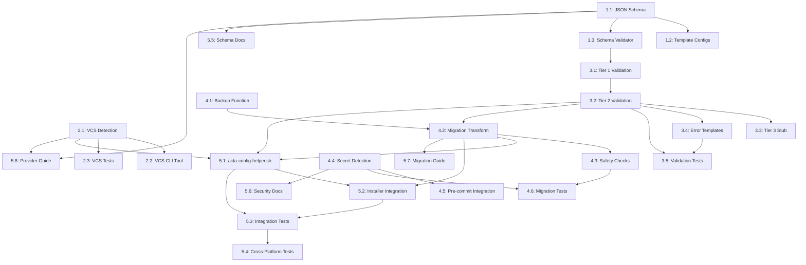

# Implementation Plan: Configuration System with VCS Abstraction

## Overview

**Issue**: #55 - Create configuration system with .claude/config.yml schema
**Milestone**: 0.1.0
**Created**: 2025-10-20
**Estimated Total Complexity**: HIGH (40-60 hours)

## Phased Approach

This implementation is broken into 5 phases that can be tackled incrementally:

### Phase 1: JSON Schema Foundation (8-10 hours)

Core schema design and validation infrastructure

### Phase 2: VCS Auto-Detection (6-8 hours)

Git remote parsing and provider detection

### Phase 3: Config Validation Framework (8-12 hours)

Three-tier validation with provider-specific rules

### Phase 4: Migration & Security (10-16 hours)

Safe migration from old config + secret detection

### Phase 5: Testing & Documentation (8-14 hours)

Comprehensive testing and documentation

---

## Phase 1: JSON Schema Foundation

**Goal**: Create JSON Schema and basic validation infrastructure

**Estimated Effort**: 8-10 hours

### Tasks

#### Task 1.1: Design JSON Schema Structure

**Type**: implementation
**Agent**: configuration-specialist
**Complexity**: medium
**Dependencies**: []

**Description**:
Create JSON Schema (Draft-07) for the new configuration system with namespaces for `vcs.*`, `work_tracker.*`, `team.*`, and `workflow.*`.

**Acceptance Criteria**:

- File created at `lib/installer-common/config-schema.json`
- Schema includes all four namespaces with documented fields
- Uses conditional validation (`if/then`) for provider-specific requirements
- Includes pattern validation for URLs, UUIDs, project keys
- Has `additionalProperties: false` to catch typos
- Validates successfully with `ajv-cli` or `check-jsonschema`
**Files Affected**:
- `lib/installer-common/config-schema.json` (new)
**Implementation Notes**:
- Use JSON Schema Draft-07 specification
- Reference PRD.md lines 320-377 for recommended schema structure
- Include examples in schema descriptions
- Document default values

---

#### Task 1.2: Create Template Config Files

**Type**: configuration
**Agent**: configuration-specialist
**Complexity**: low
**Dependencies**: [1.1]

**Description**:
Create template configuration files for common scenarios (GitHub simple, GitHub enterprise, GitLab+Jira, Bitbucket).

**Acceptance Criteria**:

- Directory created at `templates/config/`
- Template files created:
  - `config.json.template` (generic with placeholders)
  - `config-github-simple.json` (minimal GitHub config)
  - `config-github-enterprise.json` (GitHub Enterprise example)
  - `config-gitlab-jira.json` (GitLab VCS + Jira work tracker)
  - `config-bitbucket.json` (Bitbucket example)
- All templates validate against schema
- Templates include inline comments (in description fields)
- Placeholders clearly marked (e.g., `{{OWNER}}`, `{{REPO}}`)
**Files Affected**:
- `templates/config/config.json.template` (new)
- `templates/config/config-github-simple.json` (new)
- `templates/config/config-github-enterprise.json` (new)
- `templates/config/config-gitlab-jira.json` (new)
- `templates/config/config-bitbucket.json` (new)
**Implementation Notes**:
- Use real-world examples from the codebase where possible
- Include comments explaining each section
- Reference schema for field descriptions

---

#### Task 1.3: Create Basic Schema Validator Script

**Type**: implementation
**Agent**: shell-script-specialist
**Complexity**: medium
**Dependencies**: [1.1]

**Description**:
Create a shell script that validates JSON config files against the schema using available validators (ajv-cli, check-jsonschema, or jq fallback).

**Acceptance Criteria**:

- File created at `lib/installer-common/validate-schema.sh`
- Detects available validators in order: ajv-cli → check-jsonschema → jq
- Returns appropriate exit codes (0=valid, 1=invalid)
- Provides clear error messages with line numbers
- Includes `--help` and `--verbose` flags
- Passes shellcheck with zero warnings
**Files Affected**:

- `lib/installer-common/validate-schema.sh` (new)
**Implementation Notes**:

- Follow existing patterns from `validation.sh`
- Use tiered fallback for validators
- Format errors clearly for user consumption

---

### Phase 1 Success Criteria

- [x] JSON Schema validates all template configs
- [x] Template configs cover common use cases
- [x] Basic validator script works with fallback options
- [x] All scripts pass shellcheck
- [x] Templates validate against schema

---

## Phase 2: VCS Auto-Detection

**Goal**: Parse git remotes and auto-detect VCS providers

**Estimated Effort**: 6-8 hours

### Tasks

#### Task 2.1: Implement VCS Detection Functions

**Type**: implementation
**Agent**: shell-script-specialist
**Complexity**: medium
**Dependencies**: []

**Description**:
Create shell functions to parse git remote URLs and extract provider/owner/repo information for GitHub, GitLab, and Bitbucket.

**Acceptance Criteria**:

- File created at `lib/installer-common/vcs-detector.sh`
- Function `detect_vcs_provider()` returns provider name
- Functions for extracting metadata:
  - `extract_github_info()` (SSH + HTTPS)
  - `extract_gitlab_info()` (SSH + HTTPS)
  - `extract_bitbucket_info()` (SSH + HTTPS)
- Function `detect_main_branch()` gets default branch
- Function `get_detection_confidence()` returns high/medium/low
- Regex patterns handle standard and enterprise URLs
- Returns JSON output with all detected values
**Files Affected**:

- `lib/installer-common/vcs-detector.sh` (new)
**Implementation Notes**:

- Reference TECH_SPEC.md lines 260-268 for regex patterns
- Handle both SSH (git@) and HTTPS formats
- Support GitHub Enterprise, GitLab self-hosted
- Include confidence scoring

---

#### Task 2.2: Create VCS Detection CLI Tool

**Type**: implementation
**Agent**: shell-script-specialist
**Complexity**: low
**Dependencies**: [2.1]

**Description**:
Create a standalone CLI tool that wraps the VCS detection functions for testing and debugging.

**Acceptance Criteria**:

- File created at `scripts/detect-vcs.sh`
- Supports `--verbose` flag for detailed output
- Supports `--json` flag for machine-readable output
- Supports `--path` flag to specify git repository path
- Returns appropriate exit codes (0=detected, 1=failed)
- Includes usage documentation
**Files Affected**:

- `scripts/detect-vcs.sh` (new)
**Implementation Notes**:

- Use as testing/debugging tool during development
- Will be useful for `/aida-init` command in Issue #56

---

#### Task 2.3: Add Unit Tests for VCS Detection

**Type**: testing
**Agent**: qa-engineer
**Complexity**: medium
**Dependencies**: [2.1]

**Description**:
Create comprehensive unit tests for VCS detection covering various URL formats and edge cases.

**Acceptance Criteria**:

- File created at `tests/unit/test_vcs_detection.bats`
- Tests cover:
  - GitHub SSH/HTTPS (standard + enterprise)
  - GitLab SSH/HTTPS (standard + self-hosted)
  - Bitbucket SSH/HTTPS
  - Invalid URLs (graceful failure)
  - Multiple remotes (prioritize origin)
  - Missing git remote (return empty)
- All tests pass with bats
- Edge cases documented in test comments
**Files Affected**:

- `tests/unit/test_vcs_detection.bats` (new)
- `tests/fixtures/git-remotes/` (new, test fixtures)
**Implementation Notes**:

- Use bats testing framework (already in project)
- Create fixture files for different remote scenarios
- Test confidence scoring

---

### Phase 2 Success Criteria

- [x] VCS detection works for GitHub, GitLab, Bitbucket
- [x] Handles both SSH and HTTPS URL formats
- [x] CLI tool provides useful debugging output
- [x] Unit tests cover 90%+ of detection logic
- [x] Confidence scoring works correctly

---

## Phase 3: Config Validation Framework

**Goal**: Three-tier validation (structure → provider rules → connectivity)

**Estimated Effort**: 8-12 hours

### Tasks

#### Task 3.1: Implement Tier 1 Validation (Structure)

**Type**: implementation
**Agent**: shell-script-specialist
**Complexity**: medium
**Dependencies**: [1.3]

**Description**:
Create the first tier of validation that uses JSON Schema to validate config structure, types, and required fields.

**Acceptance Criteria**:

- File created at `lib/installer-common/config-validator.sh`
- Function `validate_structure()` uses schema validation
- Returns exit code 1 on structure failures
- Provides clear error messages with field paths
- Shows which fields are missing/invalid
- Suggests corrections for common mistakes
**Files Affected**:

- `lib/installer-common/config-validator.sh` (new)
**Implementation Notes**:

- Leverage validate-schema.sh from Task 1.3
- Format errors for readability
- Include field path in error messages (e.g., "vcs.github.owner")

---

#### Task 3.2: Implement Tier 2 Validation (Provider Rules)

**Type**: implementation
**Agent**: shell-script-specialist
**Complexity**: high
**Dependencies**: [3.1]

**Description**:
Create provider-specific validation functions that enforce requirements based on the active provider (e.g., GitHub requires owner+repo, GitLab requires project_id).

**Acceptance Criteria**:

- Functions added to `config-validator.sh`:
  - `validate_provider_rules()` (dispatcher)
  - `validate_github_config()` (GitHub-specific)
  - `validate_gitlab_config()` (GitLab-specific)
  - `validate_bitbucket_config()` (Bitbucket-specific)
  - `validate_jira_config()` (Jira format validation)
  - `validate_linear_config()` (Linear UUID validation)
- Returns exit code 2 on provider rule failures
- Validates format patterns (URLs, project keys, UUIDs)
- Provides provider-specific error templates
- Suggests fixes with auto-detected values
**Files Affected**:

- `lib/installer-common/config-validator.sh` (modify)
**Implementation Notes**:

- Reference PRD.md lines 214-221 for provider validation rules
- Use regex for format validation (Jira project_key, Linear UUIDs)
- No API calls (format validation only)

---

#### Task 3.3: Implement Tier 3 Validation (Connectivity - Stub)

**Type**: implementation
**Agent**: shell-script-specialist
**Complexity**: low
**Dependencies**: [3.2]

**Description**:
Create stub for optional connectivity validation (API reachability). Implementation deferred to provider implementation issues, but framework should exist.

**Acceptance Criteria**:

- Function `validate_connectivity()` added with `--verify-connection` flag
- Returns exit code 3 on connectivity failures
- Currently returns "not implemented" with clear message
- Documents what will be implemented in Issues #56-59
- Includes TODO comments for future implementation
**Files Affected**:

- `lib/installer-common/config-validator.sh` (modify)
**Implementation Notes**:

- Placeholder only - no actual API calls
- Should gracefully skip if flag not provided
- Document future implementation approach

---

#### Task 3.4: Create Error Message Templates

**Type**: implementation
**Agent**: shell-systems-ux-designer
**Complexity**: medium
**Dependencies**: [3.2]

**Description**:
Create clear, actionable error message templates for validation failures with auto-detected values and fix suggestions.

**Acceptance Criteria**:

- Function `show_provider_fix_suggestion()` added
- Templates created for each provider type
- Error messages include:
  - What went wrong
  - Auto-detected values (if available)
  - Quick fix command (if applicable)
  - Manual fix instructions
  - Link to documentation
- Messages follow progressive disclosure pattern
- Uses color coding for readability (if terminal supports it)
**Files Affected**:

- `lib/installer-common/config-validator.sh` (modify)
**Implementation Notes**:

- Reference PRD.md lines 402-428 for error message template
- Use existing color functions from colors.sh
- Keep messages concise but helpful

---

#### Task 3.5: Add Unit Tests for Validation Framework

**Type**: testing
**Agent**: qa-engineer
**Complexity**: high
**Dependencies**: [3.2, 3.4]

**Description**:
Create comprehensive unit tests for all three validation tiers covering success and failure cases for each provider.

**Acceptance Criteria**:

- File created at `tests/unit/test_config_validation.bats`
- Tests cover:
  - Tier 1: Valid/invalid structure (25+ cases)
  - Tier 2: Provider rules for each provider (30+ cases)
  - Tier 3: Connectivity stub behavior (5+ cases)
  - Error message formatting (10+ cases)
  - Edge cases: empty config, unknown provider, etc.
- All tests pass
- Fixtures created for test configs
**Files Affected**:

- `tests/unit/test_config_validation.bats` (new)
- `tests/fixtures/configs/` (new, test fixtures)
**Implementation Notes**:

- Create fixture configs for each test scenario
- Test both success and failure paths
- Validate error message content

---

### Phase 3 Success Criteria

- [x] Three-tier validation framework complete
- [x] Provider-specific validation works for all providers
- [x] Error messages are clear and actionable
- [x] Unit tests achieve 90%+ coverage
- [x] Validation completes in <150ms (Tier 1+2)

---

## Phase 4: Migration & Security

**Goal**: Safe migration from old config + secret detection

**Estimated Effort**: 10-16 hours

### Tasks

#### Task 4.1: Implement Config Backup Function

**Type**: implementation
**Agent**: shell-script-specialist
**Complexity**: medium
**Dependencies**: []

**Description**:
Create safe backup functionality that creates timestamped backups with validation and cleanup of old backups.

**Acceptance Criteria**:

- File created at `lib/installer-common/config-migration.sh`
- Function `backup_config()` creates timestamped backups
- Function `restore_config_from_backup()` provides atomic restore
- Function `cleanup_old_backups()` keeps last N backups (default: 5)
- Backups stored with format: `config.json.backup.TIMESTAMP`
- Validates backup after creation
- Returns appropriate exit codes
**Files Affected**:

- `lib/installer-common/config-migration.sh` (new)
**Implementation Notes**:

- Use atomic operations (write to temp, then move)
- Validate backup immediately after creation
- Include metadata in backup (version, date, reason)

---

#### Task 4.2: Implement Migration Transform Logic

**Type**: implementation
**Agent**: shell-script-specialist
**Complexity**: high
**Dependencies**: [4.1, 3.2]

**Description**:
Create migration logic to transform old `github.*` namespace to new `vcs.github.*` structure with validation and rollback.

**Acceptance Criteria**:

- Function `migrate_config()` orchestrates migration
- Function `migrate_github_to_vcs()` transforms namespace
- Detects old config version (checks for `github.*` at root level)
- Transforms fields:
  - `github.owner` → `vcs.owner`
  - `github.repo` → `vcs.repo`
  - `github.*` → `vcs.github.*`
  - `workflow.pull_requests.reviewers` → `team.default_reviewers`
- Validates migrated config before applying
- Auto-rollback on validation failure
- Idempotent (running twice produces same result)
**Files Affected**:

- `lib/installer-common/config-migration.sh` (modify)
**Implementation Notes**:

- Use jq for JSON transformations
- Reference TECH_SPEC.md lines 295-311 for migration approach
- Test with multiple config variations

---

#### Task 4.3: Add Migration Safety Checks

**Type**: implementation
**Agent**: shell-script-specialist
**Complexity**: medium
**Dependencies**: [4.2]

**Description**:
Add comprehensive safety checks to migration process including dry-run mode, validation, and detailed logging.

**Acceptance Criteria**:

- `migrate_config()` supports `--dry-run` flag
- Logs all transformations (before/after values)
- Verifies no data loss during migration
- Compares field counts (old vs new)
- Reports any fields that couldn't be migrated
- Creates migration report file
**Files Affected**:

- `lib/installer-common/config-migration.sh` (modify)
**Implementation Notes**:

- Log to temp file during migration
- Compare JSON structure before/after
- Report migration statistics

---

#### Task 4.4: Implement Secret Detection Pre-commit Hook

**Type**: implementation
**Agent**: privacy-security-auditor
**Complexity**: medium
**Dependencies**: []

**Description**:
Create pre-commit hook to detect secrets in config files using pattern matching for common token formats.

**Acceptance Criteria**:

- File created at `scripts/validate-config-security.sh`
- Detects secret patterns:
  - GitHub tokens: `ghp_*`, `github_pat_*`
  - Jira tokens (context-aware)
  - Linear API keys: `lin_api_*`
  - Anthropic keys: `sk-ant-*`
  - Generic patterns: `"api_key": "..."`, `"token": "..."`
- Returns exit code 1 if secrets found
- Provides clear error messages with remediation steps
- Explains how to use environment variables
- Passes shellcheck
**Files Affected**:

- `scripts/validate-config-security.sh` (new)
**Implementation Notes**:

- Reference TECH_SPEC.md lines 331-353 for secret patterns
- Use context-aware matching (check surrounding text)
- Avoid false positives on example values

---

#### Task 4.5: Integrate Secret Detection with Pre-commit

**Type**: configuration
**Agent**: devops-engineer
**Complexity**: low
**Dependencies**: [4.4]

**Description**:
Add secret detection hook to `.pre-commit-config.yaml` to run automatically on config file changes.

**Acceptance Criteria**:

- Hook added to `.pre-commit-config.yaml`
- Runs on `config.json` file changes
- Integrates with existing gitleaks hook
- Provides clear output on failure
- Documents bypass procedure (`--no-verify`)
**Files Affected**:

- `.pre-commit-config.yaml` (modify)
**Implementation Notes**:

- Add to local hooks section
- Use `files: 'config\.json$'` pattern
- Test with intentional secret to verify

---

#### Task 4.6: Add Migration and Security Tests

**Type**: testing
**Agent**: qa-engineer
**Complexity**: high
**Dependencies**: [4.3, 4.4]

**Description**:
Create comprehensive tests for migration logic and secret detection covering edge cases and failure scenarios.

**Acceptance Criteria**:

- File created at `tests/unit/test_config_migration.bats`
- File created at `tests/unit/test_secret_detection.bats`
- Migration tests cover:
  - Successful migration from old format
  - Rollback on validation failure
  - Idempotent behavior (run twice)
  - Dry-run mode
  - Backup creation and restoration
- Secret detection tests cover:
  - All token patterns (30+ test cases)
  - False positives (example values)
  - Context-aware detection
- All tests pass
**Files Affected**:

- `tests/unit/test_config_migration.bats` (new)
- `tests/unit/test_secret_detection.bats` (new)
- `tests/fixtures/configs/old-format/` (new)
**Implementation Notes**:

- Create fixtures with old config format
- Test migration with real-world configs
- Include fixtures with intentional secrets for detection testing

---

### Phase 4 Success Criteria

- [x] Migration from old config format works safely
- [x] Backup and rollback mechanisms tested
- [x] Secret detection catches all common token patterns
- [x] Pre-commit hook blocks commits with secrets
- [x] Migration is idempotent and safe
- [x] Unit tests cover migration and security

---

## Phase 5: Testing & Documentation

**Goal**: Comprehensive testing and complete documentation

**Estimated Effort**: 8-14 hours

### Tasks

#### Task 5.1: Integration with aida-config-helper.sh

**Type**: implementation
**Agent**: shell-script-specialist
**Complexity**: medium
**Dependencies**: [2.1, 3.2, 4.2]

**Description**:
Update existing `aida-config-helper.sh` to integrate new namespaces, auto-detection, and migration check.

**Acceptance Criteria**:

- Updated `get_system_defaults()` includes `vcs.*`, `work_tracker.*`, `team.*`
- Updated `validate_config()` uses new `config-validator.sh`
- Added migration check in `get_merged_config()` (auto-migrate if needed)
- Integrated VCS auto-detection if `vcs.provider` empty
- Preserved existing caching infrastructure
- Backward compatible during transition period
**Files Affected**:

- `lib/aida-config-helper.sh` (modify)
**Implementation Notes**:

- Minimal changes to existing code
- Leverage new utility scripts
- Maintain existing performance characteristics

---

#### Task 5.2: Update Installer Integration

**Type**: implementation
**Agent**: shell-script-specialist
**Complexity**: medium
**Dependencies**: [4.2, 5.1]

**Description**:
Update installer to set file permissions, run migration check, and add .gitignore entries for config files.

**Acceptance Criteria**:

- `install.sh` sets permissions:
  - User config: `chmod 600 ~/.claude/config.json`
  - Project config: `chmod 644 .aida/config.json`
- Runs migration check on install/upgrade
- Generates initial config from template
- Adds to .gitignore:
  - `~/.claude/config.json` (user config)
  - `*.backup.*` (backup files)
- Works in both normal and dev mode
**Files Affected**:

- `install.sh` (modify)
**Implementation Notes**:

- Reference TECH_SPEC.md lines 396-420 for integration approach
- Test with fresh install and upgrade scenarios
- Ensure dev mode symlinks work correctly

---

#### Task 5.3: Create Integration Tests

**Type**: testing
**Agent**: qa-engineer
**Complexity**: high
**Dependencies**: [5.1, 5.2]

**Description**:
Create end-to-end integration tests covering complete workflows (fresh install, migration, rollback).

**Acceptance Criteria**:

- File created at `tests/integration/test_config_workflow.sh`
- Test scenarios:
  - Fresh install with auto-detection
  - Upgrade with auto-migration
  - Rollback on migration failure
  - Multi-provider configs
  - Pre-commit hook integration
- Tests run in isolated environments
- Tests pass on macOS and Linux
- Docker-based tests for cross-platform validation
**Files Affected**:

- `tests/integration/test_config_workflow.sh` (new)
**Implementation Notes**:

- Use temporary directories for isolation
- Clean up after each test
- Test both success and failure paths

---

#### Task 5.4: Cross-Platform Testing

**Type**: testing
**Agent**: qa-engineer
**Complexity**: medium
**Dependencies**: [5.3]

**Description**:
Validate that all components work correctly on macOS (BSD) and Linux (GNU) with platform-specific command differences.

**Acceptance Criteria**:

- Tests pass on:
  - macOS (BSD userland)
  - Ubuntu 22.04 (GNU userland)
  - Ubuntu 20.04
  - Debian 12
- Platform-specific differences handled:
  - `stat` command (macOS `-f` vs Linux `-c`)
  - `realpath` vs `readlink -f`
  - Bash 3.2 compatibility (macOS default)
- Docker-based test matrix created
- CI/CD workflow updated to run tests
**Files Affected**:

- `.github/workflows/test-config-system.yml` (new)
- `.github/testing/docker/` (new, Dockerfiles for test envs)
**Implementation Notes**:

- Reference existing `.github/testing/` infrastructure
- Use matrix strategy for multiple platforms
- Test file permission enforcement

---

#### Task 5.5: Create Schema Reference Documentation

**Type**: documentation
**Agent**: technical-writer
**Complexity**: medium
**Dependencies**: [1.1]

**Description**:
Create comprehensive schema reference documentation auto-generated from JSON Schema with examples and best practices.

**Acceptance Criteria**:

- File created at `docs/configuration/schema-reference.md`
- Documents all namespaces:
  - `vcs.*` (all providers)
  - `work_tracker.*` (all types)
  - `team.*` (review strategies, members)
  - `workflow.*` (automation settings)
- Includes examples for each provider
- Documents required vs optional fields
- Explains validation rules
- Links to template files
**Files Affected**:

- `docs/configuration/schema-reference.md` (new)
**Implementation Notes**:

- Auto-generate from schema where possible
- Include real-world examples
- Cross-reference with templates

---

#### Task 5.6: Create Security Model Documentation

**Type**: documentation
**Agent**: privacy-security-auditor
**Complexity**: medium
**Dependencies**: [4.4]

**Description**:
Document the security model for config files including secret management, file permissions, and audit trail requirements.

**Acceptance Criteria**:

- File created at `docs/configuration/security-model.md`
- Documents:
  - Secret management (environment variables)
  - File permissions (600 vs 644)
  - Pre-commit hook usage
  - Audit trail logging
  - Secret detection patterns
  - Remediation procedures
- Includes examples of secure configs
- Explains GDPR compliance (usernames vs emails)
**Files Affected**:

- `docs/configuration/security-model.md` (new)
**Implementation Notes**:

- Reference PRD.md NFR1 (Security requirements)
- Include examples of what NOT to do
- Document incident response procedures

---

#### Task 5.7: Create Migration Guide

**Type**: documentation
**Agent**: technical-writer
**Complexity**: medium
**Dependencies**: [4.2]

**Description**:
Create step-by-step migration guide for users upgrading from old config format to new schema.

**Acceptance Criteria**:

- File created at `docs/migration/v0-to-v1-config.md`
- Documents:
  - What changed (namespace reorganization)
  - Migration process (automatic + manual)
  - Rollback procedure
  - Troubleshooting common issues
  - FAQ
- Includes before/after examples
- Explains deprecation timeline
**Files Affected**:

- `docs/migration/v0-to-v1-config.md` (new)
**Implementation Notes**:

- Reference TECH_SPEC.md migration strategy
- Include troubleshooting tips
- Provide manual migration instructions as backup

---

#### Task 5.8: Create Provider Integration Guide

**Type**: documentation
**Agent**: integration-specialist
**Complexity**: low
**Dependencies**: [1.1, 2.1]

**Description**:
Document the provider abstraction pattern and how to add support for new VCS providers (for future contributors).

**Acceptance Criteria**:

- File created at `docs/integration/vcs-providers.md`
- Documents:
  - Provider interface specification
  - Auto-detection pattern extension
  - Validation rule addition
  - Template creation
- Includes example for adding new provider (Gitea)
- Explains namespace isolation benefits
**Files Affected**:

- `docs/integration/vcs-providers.md` (new)
**Implementation Notes**:

- Focus on extensibility
- Provide concrete examples
- Reference existing provider implementations

---

### Phase 5 Success Criteria

- [x] aida-config-helper.sh integrated with new components
- [x] Installer handles migration and permissions
- [x] Integration tests pass end-to-end workflows
- [x] Cross-platform tests pass on all target platforms
- [x] Documentation complete and accurate
- [x] All code passes quality checks (shellcheck, markdownlint)

---

## Task Dependencies Graph

---

## Agent Allocation

**shell-script-specialist**: 11 tasks

- VCS detection, validation framework, migration logic, installer updates

**configuration-specialist**: 2 tasks

- JSON Schema design, template configs

**qa-engineer**: 5 tasks

- All testing tasks (unit, integration, cross-platform)

**privacy-security-auditor**: 2 tasks

- Secret detection, security documentation

**technical-writer**: 3 tasks

- Schema reference, migration guide, provider guide

**shell-systems-ux-designer**: 1 task

- Error message templates

**devops-engineer**: 1 task

- Pre-commit integration

**integration-specialist**: 1 task

- Provider integration guide

---

## Risk Assessment

**High-Risk Tasks**:

- Task 4.2 (Migration Transform Logic) - Complex jq transformations, many edge cases
- Task 3.2 (Tier 2 Validation) - Provider-specific rules, complex validation logic
- Task 5.3 (Integration Tests) - End-to-end workflows, environmental dependencies

**Mitigation Strategies**:

- Comprehensive testing at each phase
- Dry-run mode for migration testing
- Incremental rollout (Phase 1 → Phase 2 → ...)
- Rollback procedures documented
- Early validation of core assumptions

---

## Estimated Timeline

### Phased Approach

**Phase 1**: 8-10 hours (~1-2 days)

**Phase 2**: 6-8 hours (~1 day)

**Phase 3**: 8-12 hours (~1-2 days)

**Phase 4**: 10-16 hours (~2 days)

**Phase 5**: 8-14 hours (~1-2 days)

**Total Estimated Time**: 40-60 hours (5-8 working days)

### Critical Path

Phase 1 → Phase 2 (parallel) → Phase 3 → Phase 4 → Phase 5

Some tasks can run in parallel:

- Phase 2 (VCS detection) can start after Phase 1.1 (schema)
- Documentation tasks (Phase 5) can start as components complete

---

## Implementation Strategy

### Incremental Approach

1. **Complete Phase 1** fully before starting Phase 2
   - Ensures schema is solid foundation
   - Templates validate design decisions early

2. **Phase 2 and Phase 3** can overlap slightly
   - VCS detection doesn't depend on validation
   - Can be developed in parallel

3. **Phase 4** requires Phase 3 completion
   - Migration needs validation framework
   - Security hooks are independent

4. **Phase 5** ties everything together
   - Integration happens after components exist
   - Documentation can be drafted earlier and finalized later

### Quality Gates

After each phase:

- All unit tests pass
- Code passes shellcheck/markdownlint
- Manual testing of new features
- Documentation updated for new components

### Resumability

If implementation is interrupted:

- Each phase is self-contained
- `.implementation-state.json` tracks progress
- Can resume from any completed phase

---

## Success Metrics

**Phase 1 Complete**: Schema validates, templates exist
**Phase 2 Complete**: Auto-detection works for 3 providers
**Phase 3 Complete**: Validation catches all error types
**Phase 4 Complete**: Migration works with rollback
**Phase 5 Complete**: Integration tests pass, docs published

**Overall Success**: All acceptance criteria met across all phases

---

**Next Steps**:

1. Review this implementation plan
2. Choose which phase to start with (recommend Phase 1)
3. Execute phase tasks using specialized agents
4. Track progress with TodoWrite
5. Commit after each completed task (if auto-commit enabled)
6. Move to next phase when current phase complete

---

**Implementation Plan Created**: 2025-10-20T20:30:00Z
**Ready for Execution**: Yes
**Recommended Starting Point**: Phase 1, Task 1.1
