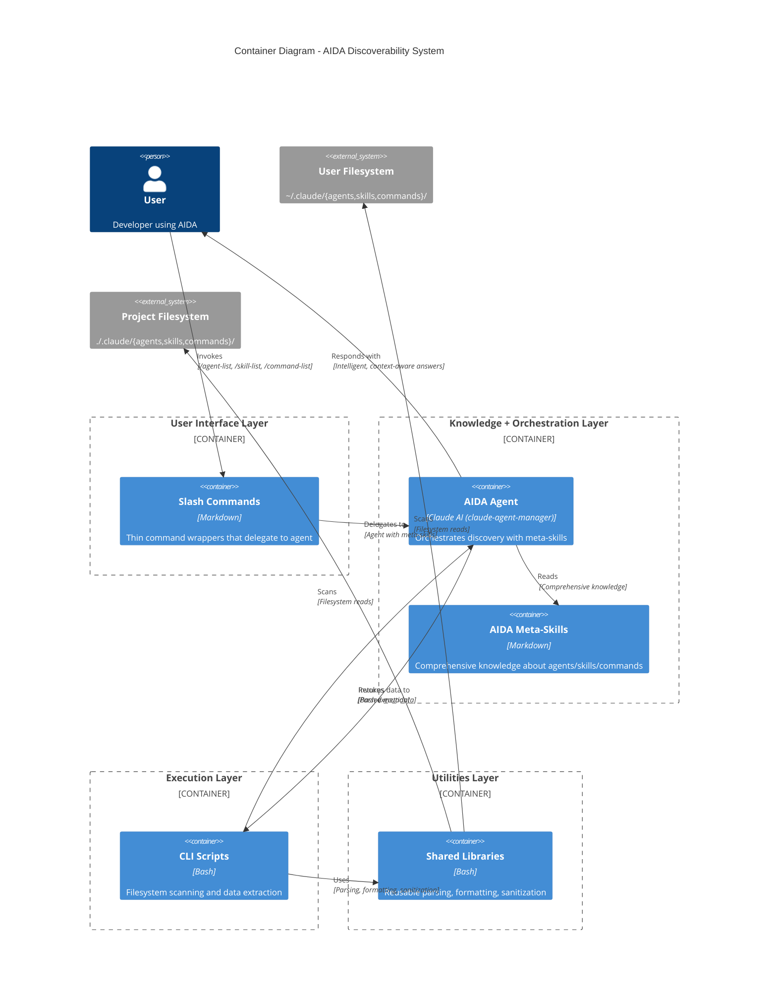

# C4 Container Diagram - AIDA Discoverability System

**Level**: 2 (Container)
**Purpose**: Show technology choices and major containers for discoverability commands
**Last Updated**: 2025-10-20
**Related**: Issue #54 - Discoverability Commands

## Overview

This diagram shows the container-level architecture for AIDA's discoverability system (`/agent-list`, `/skill-list`, `/command-list`). It demonstrates how slash commands, agents with meta-skills, CLI scripts, shared libraries, and the filesystem interact to provide intelligent discovery of AIDA's capabilities.

The key architectural pattern is multi-layer separation:

1. **User Interface Layer**: Slash commands (thin wrappers)
2. **Knowledge + Orchestration Layer**: Agent with AIDA meta-skills
3. **Execution Layer**: CLI scripts (bash)
4. **Utilities Layer**: Shared libraries (bash)
5. **Data Layer**: Filesystem (two-tier: user + project)

## Container Diagram



## Container Descriptions

### User Interface Layer

#### Slash Commands

- **Technology**: Markdown (command definitions)
- **Location**: `templates/commands/.aida/{agent-list,skill-list,command-list}.md`
- **Purpose**: Provide user-facing commands for discovery
- **Key Responsibilities**:
  - Define command interface (`/agent-list`, `/skill-list`, `/command-list`)
  - Accept arguments (`--category <name>`, `--format json`)
  - Delegate to `claude-agent-manager` with appropriate meta-skill
  - Minimal logic (thin wrappers)
- **Related ADRs**: ADR-010 (Command Structure), ADR-014 (Discoverability Architecture)

**Example**: `/agent-list` delegates to agent with `aida-agents` skill

### Knowledge + Orchestration Layer

#### AIDA Agent (claude-agent-manager)

- **Technology**: Claude AI (Anthropic Sonnet 4.5)
- **Location**: Agent orchestration system
- **Purpose**: Provide intelligent, context-aware discovery assistance
- **Key Responsibilities**:
  - Load appropriate meta-skill (aida-agents, aida-skills, aida-commands)
  - Invoke CLI scripts to gather data
  - Apply meta-skill knowledge to validate and enrich data
  - Provide intelligent responses (not just data dumps)
  - Suggest actions (create missing agents, validate structures)
- **Related ADRs**: ADR-014 (Multi-layer architecture), ADR-015 (Skills implementation)

**Example**: Agent reads `aida-agents` skill, invokes `list-agents.sh`, validates agent structures, provides recommendations

#### AIDA Meta-Skills

- **Technology**: Markdown (knowledge documents)
- **Location**: `~/.claude/skills/aida-meta/{aida-agents,aida-skills,aida-commands}/`
- **Purpose**: Comprehensive knowledge about AIDA's object model
- **Key Responsibilities**:
  - Define schemas (frontmatter fields, required vs optional)
  - Document validation rules (what makes a valid agent/skill/command)
  - Explain creation workflows (how to create well-formed objects)
  - Provide integration patterns (how to integrate with CLI scripts)
  - Describe two-tier architecture (user vs project levels)
- **Related ADRs**: ADR-009 (Skills system), ADR-015 (Skills implementation)

**Three Meta-Skills**:

1. **aida-agents**: Agent structure, creation, validation, listing
2. **aida-skills**: Skill structure, creation, validation, listing
3. **aida-commands**: Command structure, creation, validation, listing

### Execution Layer

#### CLI Scripts

- **Technology**: Bash (shell scripts)
- **Location**: `scripts/{list-agents.sh,list-skills.sh,list-commands.sh}`
- **Purpose**: Fast filesystem scanning and data extraction
- **Key Responsibilities**:
  - Scan two-tier filesystem (`~/.claude/` + `./.claude/`)
  - Parse YAML frontmatter (extract metadata)
  - Deduplicate symlinks (dev mode creates symlinks)
  - Format output (plain text tables or JSON)
  - Return data to agent (via stdout)
- **Performance**: <500ms for agents/commands, <1s for skills
- **Related ADRs**: ADR-014 (Multi-layer architecture)

**Scripts**:

- `list-agents.sh`: Scan agents, parse frontmatter, format tables/JSON
- `list-skills.sh`: Scan skills, group by category, progressive disclosure
- `list-commands.sh`: Scan commands, filter by category, format output

### Utilities Layer

#### Shared Libraries

- **Technology**: Bash (reusable shell functions)
- **Location**: `scripts/lib/{frontmatter-parser,path-sanitizer,json-formatter,readlink-portable}.sh`
- **Purpose**: Reusable utilities for parsing, formatting, sanitization
- **Key Responsibilities**:
  - Parse YAML frontmatter with sed/awk (no external dependencies)
  - Sanitize absolute paths (replace with variables for privacy)
  - Format output as JSON (machine-readable)
  - Resolve symlinks portably (macOS + Linux)
- **Related ADRs**: ADR-014 (Multi-layer architecture)

**Libraries**:

- `frontmatter-parser.sh`: Extract YAML frontmatter between --- markers
- `path-sanitizer.sh`: Replace `/Users/rob/.claude/` with `${CLAUDE_CONFIG_DIR}`
- `json-formatter.sh`: Format output as JSON for automation
- `readlink-portable.sh`: Cross-platform symlink resolution (Python fallback for macOS)

### Data Layer

#### User Filesystem

- **Technology**: YAML frontmatter + Markdown files
- **Location**: `~/.claude/{agents,skills,commands}/`
- **Purpose**: User-level (global) agents, skills, commands
- **Key Responsibilities**:
  - Store user-level agents (reusable across projects)
  - Store user-level skills (generic patterns)
  - Store user-level commands (workflow templates)
- **Related ADRs**: ADR-002 (Two-tier architecture), ADR-009 (Skills system)

**Structure**:

```text
~/.claude/
├── agents/
│   └── .aida/{agent}/{agent.md}
├── skills/
│   └── {category}/{skill}/{skill.md}
└── commands/
    └── .aida/{command}.md
```

#### Project Filesystem

- **Technology**: YAML frontmatter + Markdown files
- **Location**: `./.claude/{agents,skills,commands}/`
- **Purpose**: Project-level (specific) agents, skills, commands
- **Key Responsibilities**:
  - Store project-specific agents (custom to this project)
  - Store project-specific skills (company patterns)
  - Store project-specific commands (project workflows)
- **Related ADRs**: ADR-002 (Two-tier architecture)

**Structure**:

```text
{project}/.claude/
├── agents/
│   └── .aida/{agent}/{agent.md}
├── skills/
│   └── {category}/{skill}/{skill.md}
└── commands/
    └── .aida/{command}.md
```

## Key Interactions

### Interaction 1: User Lists Agents

**Flow**: User → Slash Command → Agent → CLI Script → Shared Libs → Filesystem → Agent → User

1. **User** invokes `/agent-list`
2. **Slash Command** delegates to `claude-agent-manager` with `aida-agents` skill
3. **AIDA Agent** reads `aida-agents` meta-skill (comprehensive agent knowledge)
4. **AIDA Agent** invokes `scripts/list-agents.sh`
5. **CLI Script** uses shared libraries to:
   - Scan `~/.claude/agents/` (user-level)
   - Scan `./.claude/agents/` (project-level)
   - Parse frontmatter (name, version, description)
   - Deduplicate symlinks (dev mode)
   - Format output (plain text table or JSON)
6. **CLI Script** returns data to **AIDA Agent**
7. **AIDA Agent** applies meta-skill knowledge:
   - Validates agent structures against schema
   - Identifies missing required fields
   - Provides context ("15 agents, 3 project-specific")
   - Suggests actions ("Missing data-engineer? Try /create-agent")
8. **AIDA Agent** responds to **User** with intelligent, context-aware answer

**Performance**: <500ms total

### Interaction 2: User Lists Skills (Progressive Disclosure)

**Flow**: User → Slash Command → Agent → CLI Script → Shared Libs → Filesystem → Agent → User

1. **User** invokes `/skill-list` (no arguments)
2. **Slash Command** delegates to `claude-agent-manager` with `aida-skills` skill
3. **AIDA Agent** reads `aida-skills` meta-skill (comprehensive skill knowledge)
4. **AIDA Agent** invokes `scripts/list-skills.sh` (no category filter)
5. **CLI Script** uses shared libraries to:
   - Scan `~/.claude/skills/` (user-level)
   - Scan `./.claude/skills/` (project-level)
   - Extract categories (28 categories)
   - Count skills per category
   - Format summary (categories only, not 177 skills)
6. **CLI Script** returns category summary to **AIDA Agent**
7. **AIDA Agent** applies meta-skill knowledge:
   - Explains category structure
   - Suggests next step ("Use /skill-list <category> to see skills")
8. **AIDA Agent** responds to **User** with category summary

**Performance**: <1s total

### Interaction 3: User Filters Commands by Category

**Flow**: User → Slash Command → Agent → CLI Script → Shared Libs → Filesystem → Agent → User

1. **User** invokes `/command-list --category workflow`
2. **Slash Command** delegates to `claude-agent-manager` with `aida-commands` skill, passes `--category workflow` argument
3. **AIDA Agent** reads `aida-commands` meta-skill (comprehensive command knowledge)
4. **AIDA Agent** invokes `scripts/list-commands.sh --category workflow`
5. **CLI Script** uses shared libraries to:
   - Scan `~/.claude/commands/` (user-level)
   - Scan `./.claude/commands/` (project-level)
   - Parse frontmatter (name, category, version, description)
   - Filter by `category: workflow`
   - Format output (plain text table or JSON)
6. **CLI Script** returns filtered data to **AIDA Agent**
7. **AIDA Agent** applies meta-skill knowledge:
   - Validates category is valid (8 allowed categories)
   - Explains command purposes
   - Suggests related commands
8. **AIDA Agent** responds to **User** with filtered command list

**Performance**: <500ms total

## Data Flow Patterns

### Two-Tier Discovery Pattern

**Pattern**: Scan both user-level and project-level, deduplicate symlinks

```text
User-Level Scan:
~/.claude/agents/ → [agent1, agent2, agent3]
                 → Deduplicate symlinks
                 → Tag as "global"

Project-Level Scan:
./.claude/agents/ → [agent4, agent5]
                 → Deduplicate symlinks
                 → Tag as "project"

Combined Output:
Global Agents: agent1, agent2, agent3
Project Agents: agent4, agent5
```

**Key**: Symlink deduplication prevents showing same agent twice in dev mode

### Progressive Disclosure Pattern

**Pattern**: Show summary first, details on demand

```text
/skill-list (no args):
→ Show 28 categories with counts
→ Don't show 177 skills (overwhelming)
→ Suggest: "Use /skill-list <category> to see skills"

/skill-list aida-meta:
→ Show 3 skills in aida-meta category
→ Detailed skill information
→ Actionable output
```

**Key**: Prevent overwhelming users, guide to next step

### Path Sanitization Pattern

**Pattern**: Replace absolute paths with variables for privacy

```text
Before Sanitization:
/Users/rob/.claude/agents/product-manager

After Sanitization:
${CLAUDE_CONFIG_DIR}/agents/product-manager

Benefits:
- No usernames exposed
- Safe for screenshots/documentation
- Portable across systems
```

**Key**: Privacy-by-default, safe sharing

## Technology Stack Summary

| Layer | Technology | Purpose |
|-------|------------|---------|
| User Interface | Markdown | Command definitions |
| Orchestration | Claude AI (Sonnet 4.5) | Intelligent agent responses |
| Knowledge | Markdown | Meta-skills with comprehensive knowledge |
| Execution | Bash | Fast filesystem scanning |
| Utilities | Bash (sed/awk) | Parsing, formatting, sanitization |
| Data | YAML + Markdown | Frontmatter metadata |

**Key Design Choice**: No external dependencies (yq, jq) - use POSIX tools (sed, awk) for maximum portability

## Non-Functional Characteristics

### Performance

- `/agent-list`: <500ms (scan ~15 agents)
- `/skill-list`: <1s (scan ~177 skills, show categories only)
- `/command-list`: <500ms (scan ~32 commands)

### Scalability

- Supports unlimited agents (tested with 15)
- Supports 177 skills (28 categories)
- Supports unlimited commands (tested with 32)

### Portability

- macOS (bash 3.2, BSD tools)
- Linux (bash 4.x+, GNU tools)
- Python fallback for `readlink -f` (macOS compatibility)

### Privacy

- Path sanitization (no absolute paths in output)
- Frontmatter-only parsing (never full file content)
- Generic error messages (no path leakage)

### Testability

- CLI scripts standalone (unit testable)
- Shared libraries reusable (unit testable)
- Agent integration testable (mock scripts)

## Security Considerations

**Filesystem Access**:

- Read-only operations (no writes)
- User permissions only (no sudo)
- Fail gracefully on permission errors

**Data Exposure**:

- Path sanitization prevents username leakage
- Frontmatter parsing prevents content exposure
- Error messages don't leak filesystem structure

**Execution Safety**:

- No external network calls (local-only)
- No privilege escalation
- Scripts run in user context

## Future Enhancements

### Phase 2 Features (Out of Scope for Issue #54)

**Search Functionality**:

- `/agent-list --search "sql"` - Search agent descriptions
- `/skill-list --search "testing"` - Search skill names/descriptions

**Interactive Selection**:

- `/agent-list --interactive` - Select agent from list
- Invoke selected agent directly

**Caching** (if performance becomes issue):

- Cache discovery results in `~/.claude/.cache/`
- 5-minute TTL
- Invalidate on filesystem changes

**Additional Filters**:

- `/agent-list --model sonnet` - Filter agents by model
- `/agent-list --color blue` - Filter agents by color

## Related Documentation

### Architecture Decision Records

- [ADR-002: Two-Tier Agent Architecture](decisions/adr-002-two-tier-agent-architecture.md)
- [ADR-009: Skills System Architecture](decisions/adr-009-skills-system-architecture.md)
- [ADR-010: Command Structure Refactoring](decisions/adr-010-command-structure-refactoring.md)
- [ADR-014: Discoverability Command Architecture](decisions/adr-014-discoverability-command-architecture.md)
- [ADR-015: Skills System Implementation](decisions/adr-015-skills-system-implementation.md)

### Implementation Documents

- PRD: `.github/issues/in-progress/issue-54/PRD.md`
- Technical Spec: `.github/issues/in-progress/issue-54/TECH_SPEC.md`
- Implementation Summary: `.github/issues/in-progress/issue-54/IMPLEMENTATION_SUMMARY.md`
- Q&A Log: `.github/issues/in-progress/issue-54/qa-log.md`

### Related Diagrams

- [C4 System Context](c4-system-context.md) - AIDA in user's environment
- [C4 Component Diagram](c4-component.md) - Internal component structure (future)

## Version History

**v1.0** - 2025-10-20

- Initial C4 container diagram for discoverability system
- Documented multi-layer architecture (5 layers)
- Defined AIDA meta-skills pattern
- Described key interactions and data flows
- Related to Issue #54 implementation
