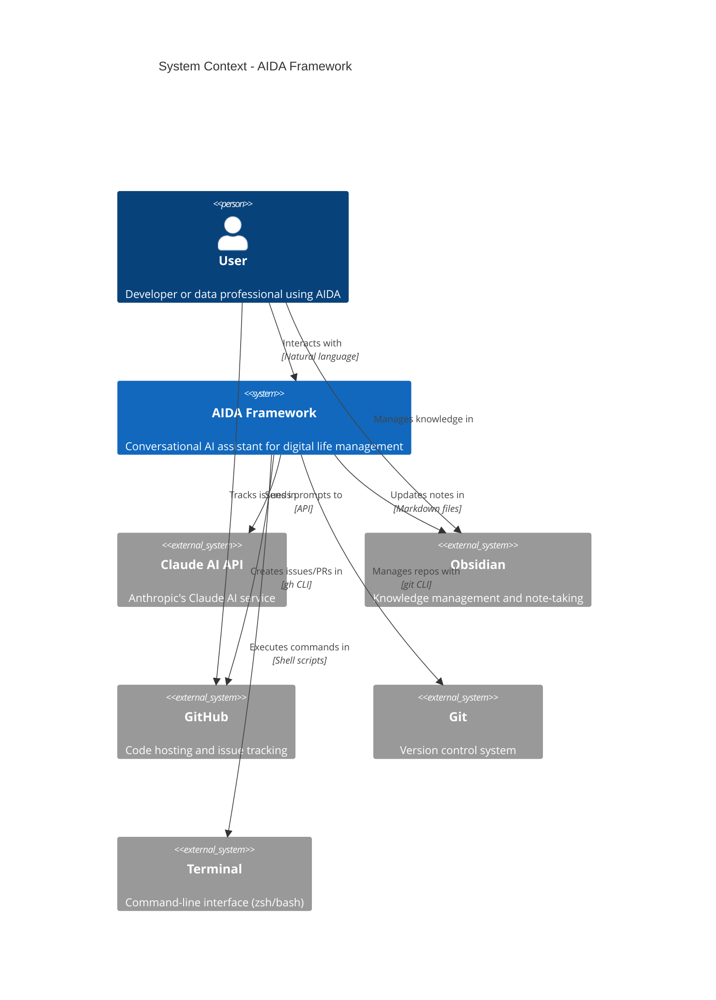

# C4 System Context - AIDA Framework

**Level**: 1 (System Context)
**Purpose**: Show how AIDA fits into the user's environment
**Last Updated**: 2025-10-15

## System Context Diagram

## Element Descriptions

### People

**User**:
- Developer, data engineer, or analyst
- Uses AIDA to manage projects, track work, and automate workflows
- Interacts via natural language in Claude AI chat

### Systems

**AIDA Framework** (The System):
- Conversational AI assistant framework
- Provides agent orchestration, personality system, knowledge management
- Installed to `~/.aida/` with user config in `~/.claude/`
- CLI commands generated at `~/.claude/commands/`

**Claude AI API** (External):
- Anthropic's Claude AI service
- Processes natural language, executes tools
- Accessed via official Claude Code or web interface

**Obsidian** (External, Optional):
- Personal knowledge management tool
- AIDA updates daily notes, project tracking, dashboards
- Integration is optional (AIDA works without Obsidian)

**GitHub** (External):
- Code hosting and issue tracking
- AIDA creates branches, issues, PRs via `gh` CLI
- Workflow commands: `/start-work`, `/open-pr`, `/cleanup-main`

**Git** (External):
- Version control for configurations and projects
- AIDA manages commits, branches, tags
- Used for dotfiles and project repositories

**Terminal** (External):
- User's command-line interface (zsh or bash)
- AIDA provides custom commands via `~/.claude/commands/`
- Shell completions and aliases

## Interactions

### User → AIDA

**Primary Interface**: Natural language in Claude AI chat

**Example Interactions**:

- "Help me implement feature X"
- "Create a PR for this work"
- "Design a dimensional model for orders"

### AIDA → External Systems

**Claude AI API**:
- Direction: AIDA → Claude
- Protocol: HTTPS API
- Purpose: AI processing, tool execution
- Frequency: Every user interaction

**Obsidian** (Optional):
- Direction: AIDA → Obsidian
- Protocol: File system (write Markdown files)
- Purpose: Update daily notes, project tracking
- Frequency: On-demand (when user requests)

**GitHub**:
- Direction: AIDA → GitHub
- Protocol: `gh` CLI (HTTPS API)
- Purpose: Create issues, PRs, manage workflow
- Frequency: Workflow commands (`/start-work`, `/open-pr`)

**Git**:
- Direction: AIDA → Git
- Protocol: `git` CLI
- Purpose: Version control, branching, committing
- Frequency: Workflow commands, commits

**Terminal**:
- Direction: AIDA → Terminal
- Protocol: Shell scripts (bash)
- Purpose: Execute commands, run workflows
- Frequency: All command executions

## System Boundaries

### In Scope (AIDA Framework)

- Agent orchestration system
- Personality system (tone, response patterns)
- Knowledge management (templates, memory, state)
- CLI command generation (`~/.claude/commands/`)
- Installation and configuration (`install.sh`)
- Workflow automation (GitHub, Git, Obsidian)

### Out of Scope (External Dependencies)

- Claude AI processing (Anthropic's responsibility)
- Obsidian application (external tool)
- GitHub service (external platform)
- Git implementation (system dependency)
- Terminal/shell (system dependency)

## Key Characteristics

**Standalone**: AIDA works without Obsidian or GitHub (core functionality only)

**Modular**: Integrations are optional plugins

- Obsidian integration: Optional, enabled via configuration
- GitHub workflow: Optional, requires `gh` CLI
- Dotfiles integration: Optional, bidirectional

**Lightweight**: Primarily shell scripts and YAML configuration

**User-Centric**: All configuration in user home directory (`~/.claude/`)

## Non-Functional Characteristics

**Performance**:
- Installation: < 30 seconds
- Command execution: < 2 seconds (most commands)
- No background processes (on-demand execution)

**Availability**:
- Offline capable (except Claude AI API calls)
- No server required (CLI-based)

**Security**:
- File permissions: 600 for user configs
- No secrets in repository
- Privacy scrubbing for knowledge sync

**Scalability**:
- Supports unlimited projects
- Supports unlimited agents
- Knowledge base grows over time

## Future Considerations

**Potential New External Systems**:
- **Notion**: Alternative to Obsidian for knowledge management
- **Linear**: Alternative to GitHub for issue tracking
- **Slack/Discord**: Notifications and status updates
- **MCP Servers**: Model Context Protocol for external tools

**Potential Internal Changes**:
- CLI tool (Rust/Go) instead of shell scripts
- Plugin registry for third-party agents/commands
- Web UI for configuration management

## Related Diagrams

- **Next Level**: [C4 Container Diagram](c4-container.md) - Shows AIDA's internal structure
- **Component Level**: [Component Architecture](component-architecture.md) - Shows major components

## References

- C4 Modeling Guide: `~/.claude/agents/system-architect/knowledge/core-concepts/c4-modeling.md`
- AIDA Architecture Docs: `docs/architecture/`
- Integration Specs: `.claude/agents-global/system-architect/specifications/integration-specifications.md`

## Version History

**v1.0** - 2025-10-15
- Initial C4 system context diagram
- Documented user, AIDA, and external systems
- Defined system boundaries and interactions
