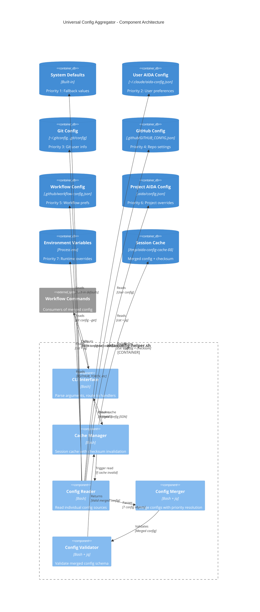

# C4 Component Diagram: Universal Config Aggregator

**Level**: Component
**Audience**: Developers, tech leads
**Purpose**: Show internal structure of config aggregator and merging strategy

## Diagram



## Components

### CLI Interface

**Responsibility**: Parse arguments and route to appropriate handlers

**Arguments**:

```bash
aida-config-helper.sh                    # Full merged config
aida-config-helper.sh --key paths.aida_home   # Specific value
aida-config-helper.sh --namespace github      # Namespace
aida-config-helper.sh --format yaml           # Output format
aida-config-helper.sh --no-cache              # Skip cache
aida-config-helper.sh --validate              # Validate only
```

**Implementation**:

```bash
main() {
  # Parse arguments
  while [[ $# -gt 0 ]]; do
    case $1 in
      --key)         KEY="$2"; shift 2 ;;
      --namespace)   NAMESPACE="$2"; shift 2 ;;
      --format)      FORMAT="$2"; shift 2 ;;
      --no-cache)    NO_CACHE=true; shift ;;
      --validate)    VALIDATE_ONLY=true; shift ;;
      *) error "Unknown argument: $1"; exit 1 ;;
    esac
  done

  # Route to handler
  if [[ "$NO_CACHE" == true ]]; then
    get_merged_config_no_cache
  elif [[ "$VALIDATE_ONLY" == true ]]; then
    validate_config
  else
    get_merged_config  # Default: Use cache
  fi
}
```

### Cache Manager

**Responsibility**: Manage session-based cache with checksum invalidation

**Cache Strategy**:

```bash
get_merged_config() {
  local cache_file="/tmp/aida-config-cache-$$"
  local checksum_file="/tmp/aida-config-checksum-$$"

  local current_checksum=$(compute_checksum)

  # Fast path: Use cache if valid
  if [[ -f "$checksum_file" ]] && \
     [[ "$(cat "$checksum_file")" == "$current_checksum" ]]; then
    cat "$cache_file"
    return 0
  fi

  # Slow path: Regenerate cache
  local merged=$(read_and_merge_all_configs)

  # Write cache
  echo "$merged" > "$cache_file"
  echo "$current_checksum" > "$checksum_file"

  echo "$merged"
}
```

**Checksum Computation**:

```bash
compute_checksum() {
  # Find all config files
  find . -maxdepth 3 \( \
    -name "aida-config.json" -o \
    -name "GITHUB_CONFIG.json" -o \
    -name "workflow-config.json" \
  \) 2>/dev/null | \
  xargs stat -f "%m" 2>/dev/null | \
  sort | md5sum
}
```

### Config Reader

**Responsibility**: Read individual config sources

**Sources** (7-tier priority):

```bash
read_all_configs() {
  # Priority 1: System defaults (built-in)
  local sys_defaults=$(get_system_defaults)

  # Priority 2: User AIDA config
  local user_aida=$(read_json_file ~/.claude/aida-config.json)

  # Priority 3: Git config
  local git_config=$(read_git_config)

  # Priority 4: GitHub config
  local github_config=$(read_json_file .github/GITHUB_CONFIG.json)

  # Priority 5: Workflow config
  local workflow_config=$(read_json_file .github/workflow-config.json)

  # Priority 6: Project AIDA config
  local project_aida=$(read_json_file .aida/config.json)

  # Priority 7: Environment variables
  local env_config=$(read_env_vars)

  # Pass all to merger
  merge_configs "$sys_defaults" "$user_aida" "$git_config" \
                "$github_config" "$workflow_config" "$project_aida" \
                "$env_config"
}
```

**Helper Functions**:

```bash
read_json_file() {
  local file="$1"
  if [[ -f "$file" ]]; then
    cat "$file"
  else
    echo "{}"
  fi
}

read_git_config() {
  local name=$(git config user.name 2>/dev/null)
  local email=$(git config user.email 2>/dev/null)

  jq -n \
    --arg name "$name" \
    --arg email "$email" \
    '{git: {user: {name: $name, email: $email}}}'
}

read_env_vars() {
  jq -n \
    --arg token "${GITHUB_TOKEN:-}" \
    --arg editor "${EDITOR:-vim}" \
    '{env: {github_token: $token, editor: $editor}}'
}
```

### Config Merger

**Responsibility**: Merge configs with priority resolution (higher priority overwrites)

**Merge Strategy**:

```bash
merge_configs() {
  local defaults="$1"
  local user_aida="$2"
  local git="$3"
  local github="$4"
  local workflow="$5"
  local project="$6"
  local env="$7"

  # Use jq to recursively merge (higher priority wins)
  jq -s '
    .[0] as $defaults |
    .[1] as $user |
    .[2] as $git |
    .[3] as $github |
    .[4] as $workflow |
    .[5] as $project |
    .[6] as $env |

    # Merge in priority order (lowest to highest)
    $defaults * $user * $git * $github * $workflow * $project * $env
  ' <(echo "$defaults") \
    <(echo "$user_aida") \
    <(echo "$git") \
    <(echo "$github") \
    <(echo "$workflow") \
    <(echo "$project") \
    <(echo "$env")
}
```

**Merge Behavior**:

```json
// Priority 2 (User AIDA config)
{
  "github": {
    "owner": "default-owner"
  }
}

// Priority 4 (GitHub config)
{
  "github": {
    "owner": "oakensoul",
    "repo": "claude-personal-assistant"
  }
}

// Priority 7 (Environment variables)
{
  "github": {
    "owner": "override-owner"
  }
}

// RESULT: Merged config (higher priority wins)
{
  "github": {
    "owner": "override-owner",        // From env vars (priority 7)
    "repo": "claude-personal-assistant"  // From GitHub config (priority 4)
  }
}
```

### Config Validator

**Responsibility**: Validate merged config against schema

**Validation Rules**:

```bash
validate_config() {
  local config="$1"

  # Check required keys
  local required_keys=(
    "paths.aida_home"
    "paths.claude_config_dir"
  )

  for key in "${required_keys[@]}"; do
    local value=$(echo "$config" | jq -r ".$key")
    if [[ "$value" == "null" ]] || [[ -z "$value" ]]; then
      error "Missing required config key: $key"
      return 1
    fi
  done

  # Check path validity
  local aida_home=$(echo "$config" | jq -r '.paths.aida_home')
  if [[ ! -d "$aida_home" ]]; then
    warning "AIDA home does not exist: $aida_home"
  fi

  return 0
}
```

**Schema Definition**:

```json
{
  "required": {
    "paths.aida_home": "string",
    "paths.claude_config_dir": "string"
  },
  "optional": {
    "user.assistant_name": "string",
    "user.personality": "string",
    "github.owner": "string",
    "github.repo": "string",
    "workflow.commit.auto_commit": "boolean"
  }
}
```

## Data Flow

### Happy Path (Warm Cache)

```text
1. Command calls: aida-config-helper.sh
2. CLI → Cache Manager: Check cache
3. Cache Manager → Cache: Read checksum
4. Cache Manager: Compute current checksum
5. Cache Manager: Compare checksums (MATCH)
6. Cache Manager → Cache: Read cached config
7. Cache Manager → CLI: Return cached config
8. CLI → Command: Output JSON to stdout

Duration: ~1-2ms
```

### Cache Miss (Cold Cache)

```text
1. Command calls: aida-config-helper.sh
2. CLI → Cache Manager: Check cache
3. Cache Manager → Cache: Read checksum
4. Cache Manager: Compute current checksum
5. Cache Manager: Compare checksums (MISMATCH)
6. Cache Manager → Reader: Read all configs
7. Reader → Config Sources (7): Read each
8. Reader → Merger: Pass 7 config objects
9. Merger: Merge with priority resolution
10. Merger → Validator: Validate merged config
11. Validator: Check schema, required keys
12. Validator → Cache Manager: Return valid config
13. Cache Manager → Cache: Write config + checksum
14. Cache Manager → CLI: Return config
15. CLI → Command: Output JSON to stdout

Duration: ~50-100ms (first call)
```

### Key-Specific Query

```text
1. Command calls: aida-config-helper.sh --key paths.aida_home
2. CLI → Cache Manager: Get merged config (cached)
3. CLI: Extract key using jq
4. CLI → Command: Output value to stdout

Example:
$ aida-config-helper.sh --key paths.aida_home
/Users/rob/.aida
```

### Namespace Query

```text
1. Command calls: aida-config-helper.sh --namespace github
2. CLI → Cache Manager: Get merged config (cached)
3. CLI: Extract namespace using jq
4. CLI → Command: Output namespace JSON to stdout

Example:
$ aida-config-helper.sh --namespace github
{
  "owner": "oakensoul",
  "repo": "claude-personal-assistant",
  "main_branch": "main"
}
```

## Performance Optimization

### Session-Based Caching

**Why Session-Based?**

- Different shells have independent caches (no conflicts)
- Cache cleaned automatically on shell exit
- No global state management needed

**Cache Key**:

```bash
CACHE_FILE="/tmp/aida-config-cache-$$"  # $$ = shell PID
```

**Benefits**:

- Isolated per shell session
- No race conditions
- Automatic cleanup (tmpfs cleared on reboot)

### Checksum Invalidation

**Why Checksum?**

- Fast check (~1ms) vs full read (~50ms)
- Detects any config file changes
- Invalidates automatically

**Checksum Algorithm**:

```bash
# Hash modification times of all config files
find . -name "*.json" | xargs stat -f "%m" | sort | md5sum
```

**Invalidation Triggers**:

- Any config file modified
- New config file added
- Config file deleted
- Git config changes (`~/.gitconfig` modified)

### Lazy Evaluation

**Only read what's needed**:

```bash
# Full config: Read all 7 sources
aida-config-helper.sh

# Specific key: Read all, extract one (still cached)
aida-config-helper.sh --key paths.aida_home
```

**Why not lazy per-source?**

- Complexity > benefit
- Full merge is fast (~10ms)
- Caching makes subsequent calls ~1ms

## Error Handling

### Missing Config Files

```bash
# Graceful fallback to empty object
read_json_file() {
  local file="$1"
  if [[ -f "$file" ]]; then
    cat "$file"
  else
    echo "{}"  # Empty object (not error)
  fi
}
```

### Invalid JSON

```bash
# Validate JSON before merging
read_json_file() {
  local file="$1"
  if [[ ! -f "$file" ]]; then
    echo "{}"
    return
  fi

  if ! jq empty "$file" 2>/dev/null; then
    error "Invalid JSON in $file"
    echo "{}"
    return
  fi

  cat "$file"
}
```

### Missing Required Keys

```bash
# Fail fast if required keys missing
validate_config() {
  local config="$1"

  for key in "${REQUIRED_KEYS[@]}"; do
    local value=$(echo "$config" | jq -r ".$key")
    if [[ "$value" == "null" ]]; then
      error "Missing required key: $key"
      error "Run: install.sh to create initial config"
      exit 1
    fi
  done
}
```

## Testing Strategy

### Unit Tests

```bash
# Test config reading
test_read_json_file() {
  echo '{"key": "value"}' > /tmp/test.json
  result=$(read_json_file /tmp/test.json)
  assert_equals '{"key": "value"}' "$result"
}

# Test merging
test_merge_configs() {
  local base='{"a": 1}'
  local override='{"a": 2, "b": 3}'
  local merged=$(merge_configs "$base" "$override")
  assert_equals '{"a": 2, "b": 3}' "$merged"
}

# Test caching
test_cache_hit() {
  # First call (cold)
  result1=$(aida-config-helper.sh)

  # Second call (warm)
  start=$(date +%s%N)
  result2=$(aida-config-helper.sh)
  duration=$(( ($(date +%s%N) - start) / 1000000 ))

  assert_equals "$result1" "$result2"
  assert_less_than "$duration" 5  # < 5ms
}
```

### Integration Tests

```bash
# Test full flow
test_config_aggregator_integration() {
  # Setup: Create test configs
  echo '{"github": {"owner": "test"}}' > .github/GITHUB_CONFIG.json

  # Execute
  config=$(aida-config-helper.sh)

  # Validate
  owner=$(echo "$config" | jq -r '.github.owner')
  assert_equals "test" "$owner"
}

# Test priority resolution
test_config_priority() {
  # Setup
  echo '{"github": {"owner": "low"}}' > ~/.claude/aida-config.json
  echo '{"github": {"owner": "high"}}' > .github/GITHUB_CONFIG.json

  # Execute
  config=$(aida-config-helper.sh)

  # Validate: GitHub config (priority 4) wins over user AIDA (priority 2)
  owner=$(echo "$config" | jq -r '.github.owner')
  assert_equals "high" "$owner"
}
```

## Debugging

### View Full Config

```bash
aida-config-helper.sh | jq
```

Output:

```json
{
  "system": { ... },
  "paths": { ... },
  "user": { ... },
  "git": { ... },
  "github": { ... },
  "workflow": { ... },
  "env": { ... }
}
```

### Explain Config Source

Future enhancement:

```bash
aida-config-helper.sh --explain github.owner
```

Output:

```text
Value: "oakensoul"
Source: .github/GITHUB_CONFIG.json (priority 4)
Overrides:
  - User AIDA config: "default-owner" (priority 2)
```

### Force Cache Refresh

```bash
aida-config-helper.sh --no-cache
```

### Validate Config

```bash
aida-config-helper.sh --validate
```

Output:

```text
✓ All required keys present
✓ Paths exist
✓ Valid JSON structure
```

## Success Metrics

- **Cache hit rate**: >95% (after first call)
- **Cold call latency**: <100ms
- **Warm call latency**: <5ms
- **I/O reduction**: 85%+ across all commands
- **Config sources**: 7 (extensible)
- **Test coverage**: >90% (unit + integration)
