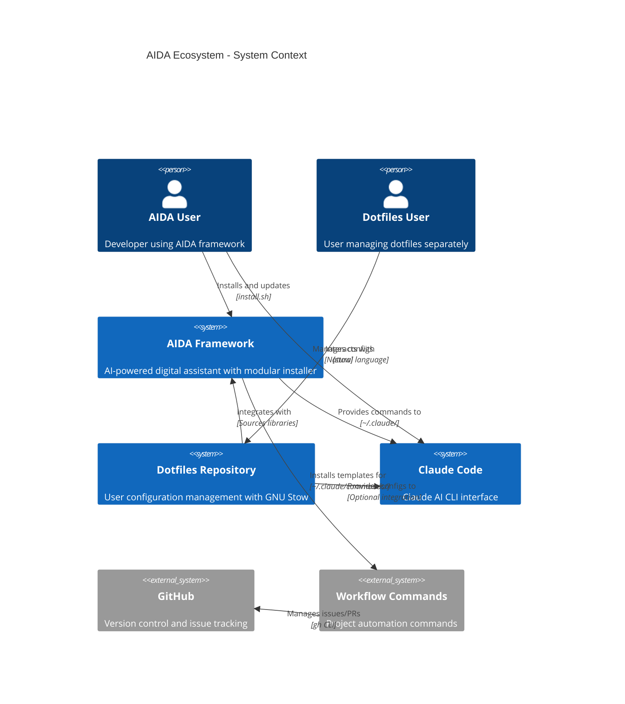

# C4 Context Diagram: AIDA Ecosystem

**Level**: System Context
**Audience**: All stakeholders
**Purpose**: Show how AIDA installer fits into broader ecosystem

## Diagram



## Description

### Primary Actors

**AIDA User**
- Installs AIDA framework via `install.sh`
- Updates framework via `git pull` + `install.sh`
- Creates custom commands, agents, skills
- Interacts with Claude Code CLI

**Dotfiles User**
- May use AIDA (optional integration)
- Manages shell/git/vim configs independently
- Can leverage AIDA installer libraries for consistency

### Systems

**AIDA Framework** (this system)
- Modular installer with reusable libraries
- Template system (commands, agents, skills)
- Configuration aggregation
- Namespace isolation for safety

**Dotfiles Repository**
- GNU Stow-based configuration management
- Can optionally integrate with AIDA
- Sources AIDA installer libraries for consistency
- Works standalone or with AIDA

**Claude Code**
- Claude AI command-line interface
- Discovers commands, agents, skills from `~/.claude/`
- Executes workflow automation
- Natural language interaction

### External Systems

**GitHub**
- Issue tracking
- Pull request management
- Workflow automation target

**Workflow Commands**
- Installed by AIDA
- Automate issue management, PR creation, etc.
- Use GitHub API via `gh` CLI

### Key Relationships

**AIDA → Claude Code**
- AIDA installs templates to `~/.claude/` directories
- Claude Code discovers and executes these templates
- Namespace isolation protects user content

**Dotfiles → AIDA**
- Dotfiles can source AIDA installer libraries
- Reuses template installation, config management
- Optional integration (works without AIDA)

**AIDA → Workflows → GitHub**
- AIDA provides workflow command templates
- Commands automate GitHub operations
- Issue tracking, PR management, labeling

## Namespace Isolation

```text
~/.claude/
├── commands/
│   ├── .aida/              ← AIDA framework (replaceable)
│   ├── .aida-deprecated/   ← Old AIDA templates (optional)
│   └── user-custom.md      ← User content (protected)
├── agents/
│   ├── .aida/              ← AIDA framework
│   └── user-agent.md       ← User content
└── skills/
    ├── .aida/              ← AIDA framework
    └── (user content)
```

## Integration Patterns

### Pattern 1: AIDA Standalone

```text
User → AIDA → Claude Code
- User installs AIDA only
- Gets full framework functionality
- No dotfiles integration
```

### Pattern 2: Dotfiles-First (Recommended)

```text
User → Dotfiles → AIDA → Claude Code
- User installs dotfiles (shell configs)
- Dotfiles optionally installs AIDA
- Full integration
```

### Pattern 3: Bi-Directional Integration

```text
User → AIDA + Dotfiles → Claude Code
- Either install order works
- AIDA and Dotfiles discover each other
- Share installer libraries
```

## Success Criteria

- AIDA works standalone (no dotfiles dependency)
- Dotfiles works standalone (no AIDA dependency)
- Integration is optional but seamless
- User content always protected
- Framework updates never destroy user work
