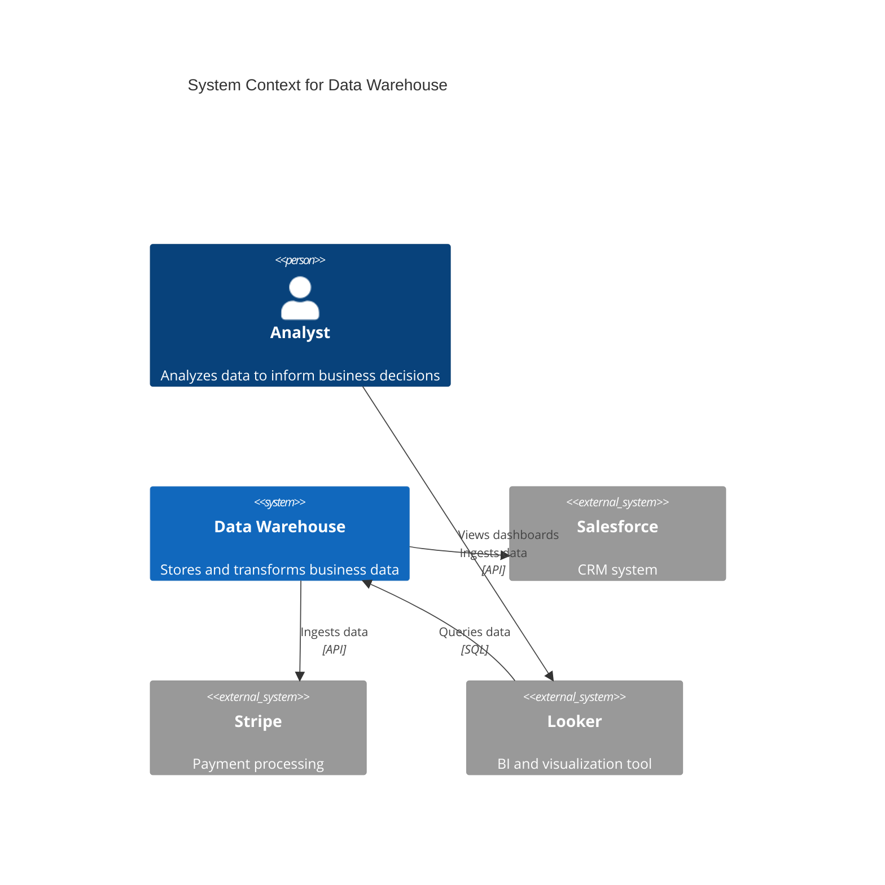

# C4 Modeling

C4 (Context, Container, Component, Code) is a hierarchical approach to software architecture diagrams that provides different levels of abstraction for different audiences.

## Overview

Created by Simon Brown, the C4 model provides a structured way to visualize software architecture at different zoom levels, similar to how Google Maps works (world → country → city → street).

## The Four Levels

### Level 1: System Context

**Purpose**: Show how your system fits into the world

**Audience**: Everyone (non-technical stakeholders, executives, developers)

**Elements**:

- **Your System**: The software system you're building (single box)
- **Users**: People who use the system (person icons)
- **External Systems**: Other systems your system interacts with (boxes)

**Relationships**: Lines showing interactions between elements

**Example**:

```text
┌─────────────┐
│   Analyst   │─────────────┐
└─────────────┘             │
                            ▼
┌─────────────┐      ┌─────────────────┐      ┌──────────────┐
│   Looker    │◀─────│  Data Warehouse │─────▶│  Salesforce  │
│  (BI Tool)  │      │   (Your System) │      │   (Source)   │
└─────────────┘      └─────────────────┘      └──────────────┘
                            │
                            ▼
                     ┌──────────────┐
                     │   Snowflake  │
                     │  (Database)  │
                     └──────────────┘
```

**When to Create**:

- Start of every project
- When explaining the system to new stakeholders
- When integration points change

**Questions it Answers**:

- Who uses the system?
- What external systems does it integrate with?
- What is the system boundary?

### Level 2: Container

**Purpose**: Show high-level technology choices and how responsibilities are distributed

**Audience**: Technical stakeholders (architects, developers, operations)

**Elements**:

- **Containers**: Separately deployable/runnable units (web app, database, message queue, etc.)
- **Technology Choices**: What each container is built with

**Note**: "Container" here means a deployable unit, not Docker containers specifically (though Docker containers are one example).

**Example**:

```text
┌─────────────────────────────────────────────────────┐
│              Data Warehouse System                  │
│                                                     │
│  ┌────────────┐  ┌─────────────┐  ┌────────────┐  │
│  │    dbt     │  │   Airflow   │  │  DataDog   │  │
│  │   Project  │  │ Orchestrator│  │ Monitoring │  │
│  │  (Python)  │  │  (Python)   │  │            │  │
│  └────────────┘  └─────────────┘  └────────────┘  │
│         │               │                 │         │
│         ▼               ▼                 ▼         │
│  ┌──────────────────────────────────────────────┐  │
│  │         Snowflake Data Warehouse             │  │
│  │              (Cloud Database)                │  │
│  └──────────────────────────────────────────────┘  │
└─────────────────────────────────────────────────────┘
```

**When to Create**:

- After system context
- When making technology stack decisions
- When planning deployment architecture

**Questions it Answers**:

- What are the major technology choices?
- How is the system deployed?
- What are the process/data boundaries?
- What communication happens between containers?

### Level 3: Component

**Purpose**: Show major structural building blocks inside each container

**Audience**: Developers, tech leads

**Elements**:

- **Components**: Groups of related functionality (controllers, services, repositories, etc.)
- **Relationships**: Dependencies between components

**Example** (for dbt container):

```text
┌─────────────────────────────────────────┐
│          dbt Project Container          │
│                                         │
│  ┌─────────────────────────────────┐   │
│  │      Staging Models             │   │
│  │  (Raw source transformations)   │   │
│  └────────────┬────────────────────┘   │
│               │                         │
│               ▼                         │
│  ┌─────────────────────────────────┐   │
│  │    Intermediate Models          │   │
│  │  (Business logic, joins)        │   │
│  └────────────┬────────────────────┘   │
│               │                         │
│               ▼                         │
│  ┌─────────────────────────────────┐   │
│  │        Mart Models              │   │
│  │  (Facts and Dimensions)         │   │
│  └─────────────────────────────────┘   │
│                                         │
│  ┌─────────────────────────────────┐   │
│  │     Macros & Tests              │   │
│  │  (Reusable logic, data quality) │   │
│  └─────────────────────────────────┘   │
└─────────────────────────────────────────┘
```

**When to Create**:

- When planning internal structure of containers
- When onboarding new developers
- When refactoring internal architecture

**Questions it Answers**:

- What are the major structural elements?
- What are the key responsibilities?
- How do components interact?

### Level 4: Code (Rare)

**Purpose**: Show implementation details (classes, functions)

**Audience**: Developers only

**Elements**:

- Classes, interfaces, functions
- Design patterns at code level

**When to Create**:

- Rarely! Most projects don't need this level
- When documenting complex algorithms or design patterns
- Usually better served by code comments and tech-lead documentation

**Why Rare**:

- Code-level diagrams quickly become outdated
- Better to read the code directly
- Tech-lead agent handles this level

## Creating C4 Diagrams

### Tools

**Simple Text-Based**:

- **Mermaid**: Renders in GitHub, Markdown viewers
- **PlantUML**: More powerful, requires separate renderer
- **Structurizr DSL**: Purpose-built for C4

**Visual Tools**:

- **draw.io / diagrams.net**: Free, browser-based
- **Lucidchart**: Commercial, collaborative
- **Structurizr**: Purpose-built for C4, has web version

### Mermaid Example (System Context)



### PlantUML Example (Container Diagram)

```plantuml
@startuml
!include https://raw.githubusercontent.com/plantuml-stdlib/C4-PlantUML/master/C4_Container.puml

Person(analyst, "Analyst", "Business analyst")

System_Boundary(warehouse, "Data Warehouse") {
    Container(dbt, "dbt Project", "Python/SQL", "Transforms raw data into analytics models")
    Container(airflow, "Airflow", "Python", "Orchestrates dbt runs")
    ContainerDb(snowflake, "Snowflake", "Cloud Database", "Stores raw and transformed data")
}

System_Ext(salesforce, "Salesforce", "CRM system")
System_Ext(looker, "Looker", "BI tool")

Rel(analyst, looker, "Views dashboards")
Rel(looker, snowflake, "Queries data", "SQL")
Rel(airflow, dbt, "Triggers runs")
Rel(dbt, snowflake, "Reads/writes data", "SQL")
Rel(snowflake, salesforce, "Ingests data", "Fivetran")
@enduml
```

## Best Practices

### Do

- **Start with Context**: Always create Level 1 first
- **Use Consistent Notation**: Stick to C4 standard shapes and colors
- **Add Technology Choices**: Label containers with technology (Python, Node.js, PostgreSQL)
- **Show Key Relationships**: Focus on important interactions, not every detail
- **Version Control Diagrams**: Store diagram source code in git
- **Keep Diagrams Updated**: Update when architecture changes

### Don't

- **Don't Skip Levels**: Don't jump straight to components without context
- **Don't Show Everything**: Focus on architecturally significant elements
- **Don't Mix Levels**: Keep each diagram at a consistent abstraction level
- **Don't Use Generic Boxes**: Label technology choices clearly
- **Don't Create Code-Level Diagrams**: Use Level 3 (components) as your most detailed view

## When to Update C4 Models

### Always Update

- New external system integration
- New container added (database, service, etc.)
- Technology stack changes
- Major architectural refactoring

### Consider Updating

- New component added within existing container
- Internal component relationships change
- Deployment model changes

### Document as ADR

When C4 models change due to architecture decisions, create an ADR documenting:

- What changed in architecture
- Why the change was made
- Link to updated C4 diagram

## C4 for Data Warehouses (dbt Projects)

### System Context Example

**System**: Data Warehouse
**Users**: Analysts, Data Scientists, Executives
**External Systems**: Source systems (Salesforce, Stripe, HubSpot), BI tools (Looker, Tableau)

### Container Example

**Containers**:

- **dbt Project**: Transforms data (Python/SQL)
- **Snowflake**: Data warehouse database
- **Airflow**: Orchestration (Python)
- **Fivetran**: Data ingestion tool
- **DataDog**: Monitoring and observability

### Component Example (dbt Project)

**Components**:

- **Staging Models**: Light transformations from sources
- **Intermediate Models**: Business logic and joins
- **Mart Models**: Analytics-ready facts and dimensions
- **Macros**: Reusable SQL logic
- **Tests**: Data quality checks

## C4 vs Other Diagrams

### C4 vs UML

- **C4**: Focuses on architecture, uses simple shapes
- **UML**: Focuses on detailed design, many diagram types

**Use C4 for**: High-level architecture communication
**Use UML for**: Detailed class design (rarely needed)

### C4 vs ERD (Entity Relationship Diagrams)

- **C4**: System architecture (containers, components)
- **ERD**: Data model (tables, columns, relationships)

**Use C4 for**: How systems are deployed and communicate
**Use ERD for**: Database schema design (handled by dimensional modeling docs)

### C4 vs Network Diagrams

- **C4**: Logical architecture (software systems)
- **Network**: Physical infrastructure (servers, networks, firewalls)

**Use C4 for**: Software architecture
**Use Network Diagrams for**: Infrastructure and networking (handled by aws-cloud-engineer)

## Examples by Project Type

### Microservices Project

**Level 1 (Context)**: Show microservices system, external APIs, users
**Level 2 (Container)**: Show each microservice, API Gateway, message queue, databases
**Level 3 (Component)**: Show internal structure of each microservice (controllers, services, repositories)

### dbt Data Warehouse Project

**Level 1 (Context)**: Show data warehouse, source systems, BI tools, users
**Level 2 (Container)**: Show dbt, Snowflake, Airflow, Fivetran, DataDog
**Level 3 (Component)**: Show dbt layers (staging, intermediate, marts), macros, tests

### Monolithic Web Application

**Level 1 (Context)**: Show web app, users, external services (payment, email)
**Level 2 (Container)**: Show web server, application server, database, cache
**Level 3 (Component)**: Show MVC components (controllers, models, views, services)

## Storing C4 Diagrams

### In Project Repository

**Location**: `{project}/.claude/project/agents/system-architect/architecture/`

**Files**:

```text
architecture/
├── c4-system-context.md (or .puml, .mermaid)
├── c4-container.md
└── c4-components-{container-name}.md
```

**Format**: Use text-based formats (Mermaid, PlantUML) for version control

### In Documentation

- **README.md**: Embed system context diagram
- **Architecture Docs**: Include container and component diagrams
- **ADRs**: Reference relevant C4 diagrams

## Common Mistakes

### Mistake 1: Too Much Detail Too Soon

**Problem**: Jumping to component-level diagrams before defining context

**Fix**: Always start with Level 1 (context), then Level 2 (container)

### Mistake 2: Mixing Abstraction Levels

**Problem**: Showing components and containers in the same diagram

**Fix**: Keep each diagram at a single abstraction level

### Mistake 3: Outdated Diagrams

**Problem**: Diagrams don't match current architecture

**Fix**: Update diagrams when architecture changes, version control diagram source

### Mistake 4: Generic Labels

**Problem**: Boxes labeled "Service" or "Database" without technology details

**Fix**: Always label with specific technology (Node.js, PostgreSQL, Redis)

## Further Reading

- **Official C4 Model Website**: <https://c4model.com/>
- **Simon Brown's Book**: Software Architecture for Developers
- **Structurizr**: <https://structurizr.com/>
- **Mermaid C4 Docs**: <https://mermaid.js.org/syntax/c4c.html>

## Version History

**v1.0** - 2025-10-15

- Initial documentation of C4 modeling approach
- Examples for software and data warehouse projects
- Best practices and common mistakes
