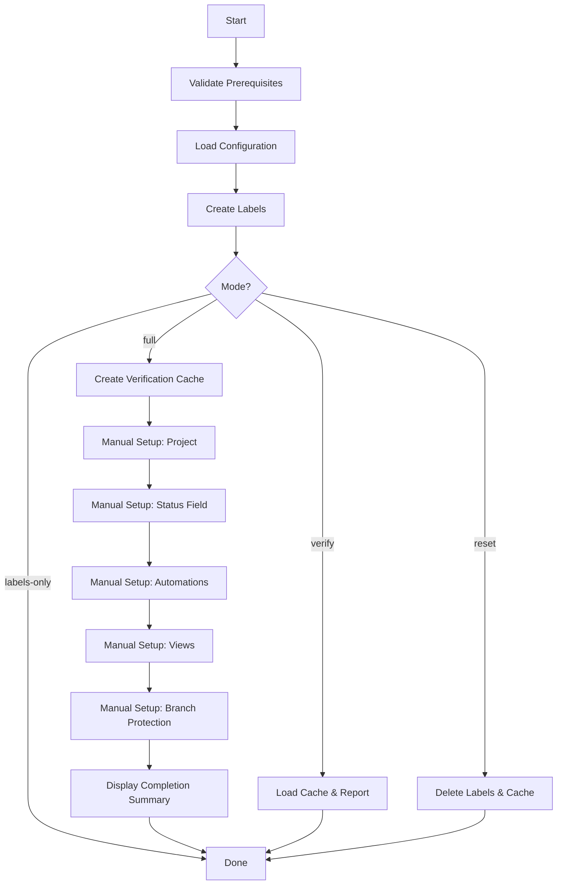

# GitHub Repository Initialization Command

Automates GitHub repository setup including labels, milestones, project boards, and provides interactive guidance for manual workflow automation configuration.

## Overview

This command initializes a GitHub repository with standardized configuration:

- **Automated**: Labels, verification cache, configuration validation
- **Guided Manual**: Project board, workflow automations, branch protection
- **Verification**: State tracking and validation

**Prerequisites:**
- GitHub CLI (`gh`) installed and authenticated
- Repository admin access
- Git repository with GitHub remote
- Existing `workflow-config.json` (run `/workflow-init` first if missing)

**Expected Duration:** 15-20 minutes (5 min automated + 10-15 min guided manual)

## Modes of Operation

### `full` (default)
Run all automated setup, then provide interactive guidance for manual configuration.

```bash
/github-init
/github-init full
```

### `labels-only`
Only create/update GitHub labels without project or automation setup.

```bash
/github-init labels-only
```

### `verify`
Check configuration without making changes. Report what's missing or incorrect.

```bash
/github-init verify
```

### `reset`
Remove all labels and clear verification cache (requires confirmation).

```bash
/github-init reset
```

---

# Phase 1: Automated Setup

This phase uses GitHub CLI to configure what can be automated.

## Step 1: Validate Prerequisites

**Invoke:** `devops-engineer` agent

Check all prerequisites before proceeding:

```bash
# Check 1: GitHub CLI installed and authenticated
gh auth status 2>&1

# Check 2: Current directory is git repository
git rev-parse --git-dir 2>&1

# Check 3: Repository has GitHub remote
git remote get-url origin 2>&1

# Check 4: User has admin access
gh repo view --json name,owner,viewerPermission --jq '.viewerPermission'
```

**Expected Results:**
- `gh auth status`: Shows "Logged in to github.com"
- `git rev-parse --git-dir`: Returns `.git`
- `git remote get-url origin`: Returns GitHub URL
- `viewerPermission`: Returns `ADMIN` or `WRITE`

**Error Handling:**

| Check Failed | Error Message | Resolution |
|--------------|---------------|------------|
| gh CLI not authenticated | `ERROR: GitHub CLI not authenticated. Run: gh auth login` | User must authenticate |
| Not a git repo | `ERROR: Current directory is not a git repository` | Navigate to repo root |
| No GitHub remote | `ERROR: Repository has no GitHub remote configured` | Add remote or check URL |
| Insufficient permissions | `ERROR: User lacks admin access to repository` | Request access from owner |

If any check fails, **STOP** and display error with resolution steps.

## Step 2: Load Configuration

**Invoke:** `devops-engineer` agent

Load workflow configuration to get GitHub settings:

```bash
# Verify workflow-config.json exists
if [ ! -f .claude/config/workflow-config.json ]; then
    echo "ERROR: workflow-config.json not found. Run /workflow-init first."
    exit 1
fi

# Extract GitHub configuration
jq '.github' .claude/config/workflow-config.json
```

**Required Configuration Keys:**
- `github.project.name`
- `github.project.statuses` (array of 10 status names)
- `github.project.views` (array of 2 view definitions)
- `github.labels` (array of label definitions)
- `github.workflow_automations` (array of automation rules)

**Error Handling:**
- If `.github` key missing: "ERROR: workflow-config.json missing GitHub section. Run /workflow-init first."
- If required keys missing: "ERROR: GitHub configuration incomplete. Check workflow-config.json"

## Step 3: Create GitHub Labels

**Invoke:** `devops-engineer` agent

Run the label creation script:

```bash
# Make script executable
chmod +x scripts/create-labels.sh

# Create all labels
./scripts/create-labels.sh

# Verify labels were created
LABEL_COUNT=$(gh label list --json name | jq -r '.[] | select(.name | startswith("version:") or startswith("build:") or startswith("build-override:")) | .name' | wc -l | xargs)

echo "Created ${LABEL_COUNT} labels"
```

**Expected Output:** `Created 26 labels` (or similar count based on script)

**Label Categories Created:**
- `version:` - Major, minor, patch version changes
- `build:` - Build scope (staging, core, marts, full-refresh, selective)
- `build-override:` - Build overrides (skip-ci, manual-only, etc.)
- Type labels (feature, fix, docs, refactor, test, chore, etc.)
- Domain labels (finance, contests, partners, shared)
- Priority labels (critical, high, normal, low)

**Error Handling:**
- Script not found: "ERROR: scripts/create-labels.sh not found"
- Script fails: Display script output and "ERROR: Label creation failed"
- Verify command fails: Warn but continue

**Mode: `labels-only`**
If mode is `labels-only`, STOP after this step and display:

```
╔════════════════════════════════════════════════════════════════════════════╗
║ ✓ LABELS CREATED                                                          ║
╚════════════════════════════════════════════════════════════════════════════╝

Created labels: 26

Review labels: gh label list
Delete deprecated: ./scripts/delete-deprecated-labels.sh
Documentation: docs/development/LABELS.md
```

## Step 4: Create Verification Cache

**Invoke:** `devops-engineer` agent

Create `.github/.verification-cache.json` to track configuration state:

```bash
# Get current timestamp
TIMESTAMP=$(date -u +"%Y-%m-%dT%H:%M:%SZ")

# Get repository info
REPO_INFO=$(gh repo view --json name,owner --jq '{name: .name, owner: .owner.login}')
REPO_NAME=$(echo "$REPO_INFO" | jq -r '.name')
REPO_OWNER=$(echo "$REPO_INFO" | jq -r '.owner')

# Calculate checksum of workflow-config.json GitHub section
CONFIG_CHECKSUM=$(jq '.github' .claude/config/workflow-config.json | shasum -a 256 | awk '{print $1}')

# Get project name from config
PROJECT_NAME=$(jq -r '.github.project.name' .claude/config/workflow-config.json)

# Count expected statuses and views
STATUS_COUNT=$(jq '.github.project.statuses | length' .claude/config/workflow-config.json)
VIEW_COUNT=$(jq '.github.project.views | length' .claude/config/workflow-config.json)
AUTOMATION_COUNT=$(jq '.github.workflow_automations | length' .claude/config/workflow-config.json)

# Create verification cache
cat > .github/.verification-cache.json <<EOF
{
  "last_verified": "${TIMESTAMP}",
  "version": "1.0",
  "repository": {
    "name": "${REPO_NAME}",
    "owner": "${REPO_OWNER}"
  },
  "labels": {
    "verified_at": "${TIMESTAMP}",
    "checksum": "${CONFIG_CHECKSUM}",
    "status": "synced",
    "count_expected": 26,
    "count_actual": ${LABEL_COUNT}
  },
  "automated_setup": {
    "completed": true,
    "completed_at": "${TIMESTAMP}"
  },
  "manual_rules": {
    "project_created": {
      "verified": false,
      "project_url": null,
      "last_checked": null
    },
    "status_field": {
      "verified": false,
      "count_expected": ${STATUS_COUNT},
      "count_actual": null,
      "last_checked": null
    },
    "workflow_automations": {
      "verified": false,
      "count_expected": ${AUTOMATION_COUNT},
      "count_actual": null,
      "steps_completed": [],
      "last_checked": null
    },
    "board_views": {
      "verified": false,
      "count_expected": ${VIEW_COUNT},
      "count_actual": null,
      "last_checked": null
    },
    "branch_protection": {
      "verified": false,
      "rules": [],
      "last_checked": null
    }
  },
  "config": {
    "project_name": "${PROJECT_NAME}",
    "statuses": ${STATUS_COUNT},
    "views": ${VIEW_COUNT},
    "automations": ${AUTOMATION_COUNT}
  }
}
EOF

echo "Verification cache created: .github/.verification-cache.json"
```

**Verification Cache Purpose:**
- Track completion of manual setup steps
- Store checksums to detect configuration drift
- Enable resumable setup if interrupted
- Support `/github-sync check` verification command

## Step 5: Automated Setup Complete

Display summary of automated setup:

```
╔════════════════════════════════════════════════════════════════════════════╗
║ ✓ AUTOMATED SETUP COMPLETE                                                ║
╚════════════════════════════════════════════════════════════════════════════╝

✓ Prerequisites validated
✓ Labels created (26)
✓ Verification cache initialized
✓ Configuration loaded

Verification cache: .github/.verification-cache.json

⚠️  GitHub Projects API does not support workflow automations via CLI.
   Manual setup required - see Phase 2 below.

   Future enhancement: Use GitHub GraphQL API to configure:
   - Auto-add items to project
   - Auto-archive stale items
   - Custom field workflows
```

**Mode: `verify`**
If mode is `verify`, load existing verification cache and report status:

```bash
# Check if verification cache exists
if [ -f .github/.verification-cache.json ]; then
    echo "Verification Cache Status:"
    jq '{
        labels: .labels.status,
        automated_setup: .automated_setup.completed,
        project_created: .manual_rules.project_created.verified,
        status_field: .manual_rules.status_field.verified,
        workflow_automations: .manual_rules.workflow_automations.verified,
        board_views: .manual_rules.board_views.verified,
        branch_protection: .manual_rules.branch_protection.verified
    }' .github/.verification-cache.json
else
    echo "ERROR: Verification cache not found. Run /github-init to create."
fi
```

STOP after displaying verification report.

---

# Phase 2: Manual Setup (Interactive)

The following setup steps require GitHub UI interaction. This command will guide you through each step with interactive prompts.

**Resume Support:** If interrupted, re-run `/github-init` to resume from last completed step (tracked in verification cache).

## Interactive Wizard Protocol

For each manual step:
1. **Check verification cache** - Skip if step already completed
2. **Display instructions** - Show formatted guidance with UI paths
3. **Wait for user confirmation** - `[Enter]` to continue, `[S]` to skip
4. **Update verification cache** - Mark step as complete
5. **Proceed to next step**

## Manual Steps Checklist

### Step 6: Create GitHub Project

**Check State:**
```bash
PROJECT_VERIFIED=$(jq -r '.manual_rules.project_created.verified' .github/.verification-cache.json)
if [ "$PROJECT_VERIFIED" = "true" ]; then
    echo "Step 6: Already complete (project created)"
    # Skip to Step 7
fi
```

**Display Instructions:**

```
╔════════════════════════════════════════════════════════════════════════════╗
║ STEP 6: Create GitHub Project Board                                       ║
╚════════════════════════════════════════════════════════════════════════════╝

GitHub Projects cannot be created via CLI. Follow these steps:

1. Navigate to Projects:
   • Organization projects: https://github.com/orgs/${REPO_OWNER}/projects
   • Repository projects: https://github.com/${REPO_OWNER}/${REPO_NAME}/projects

2. Click "New project"

3. Select "Board" template

4. Configure project:
   Name: ${PROJECT_NAME}
   Description: Project board for ${REPO_NAME}

5. Click "Create project"

6. Link to repository:
   • Project Settings → Linked repositories
   • Add: ${REPO_OWNER}/${REPO_NAME}

7. Note the project URL (you'll need this):
   Format: https://github.com/orgs/${REPO_OWNER}/projects/${NUMBER}

Press [Enter] when complete, or [S] to skip: _
```

**User Input:**
- Wait for user to press Enter or type 'S'
- If 'S': Mark step as skipped, continue
- If Enter: Prompt for project URL

```bash
echo "Enter project URL (https://github.com/orgs/${REPO_OWNER}/projects/NUMBER):"
read PROJECT_URL

# Validate URL format
if [[ ! "$PROJECT_URL" =~ ^https://github\.com/(orgs|users)/.+/projects/[0-9]+$ ]]; then
    echo "WARNING: Invalid project URL format. Expected: https://github.com/orgs/{org}/projects/{number}"
    echo "Proceeding anyway..."
fi

# Update verification cache
jq --arg url "$PROJECT_URL" --arg timestamp "$(date -u +"%Y-%m-%dT%H:%M:%SZ")" '
    .manual_rules.project_created.verified = true |
    .manual_rules.project_created.project_url = $url |
    .manual_rules.project_created.last_checked = $timestamp
' .github/.verification-cache.json > .github/.verification-cache.json.tmp
mv .github/.verification-cache.json.tmp .github/.verification-cache.json

echo "✓ Step 6 complete"
```

### Step 7: Configure Status Field

**Check State:**
```bash
STATUS_VERIFIED=$(jq -r '.manual_rules.status_field.verified' .github/.verification-cache.json)
if [ "$STATUS_VERIFIED" = "true" ]; then
    echo "Step 7: Already complete (status field configured)"
    # Skip to Step 8
fi
```

**Display Instructions:**

```
╔════════════════════════════════════════════════════════════════════════════╗
║ STEP 7: Configure Status Field                                            ║
╚════════════════════════════════════════════════════════════════════════════╝

Configure the Status field with workflow stages:

1. Open project board
2. Click Settings (gear icon) → Fields
3. Find "Status" field → Click to edit
4. Configure 10 status values IN ORDER:

$(jq -r '.github.project.statuses | to_entries[] | "   \(.key + 1). \(.value)"' .claude/config/workflow-config.json)

5. Set colors as desired (suggested):
   • Parking Lot: Gray
   • Triage: Yellow
   • Ready: Blue
   • Prioritized: Purple
   • In progress: Orange
   • In review: Light blue
   • Done: Green
   • Won't fix: Red
   • Duplicate: Gray
   • Invalid: Red

6. Save changes

Reference: .claude/config/workflow-config.json → github.project.statuses

Press [Enter] when complete, or [S] to skip: _
```

**User Input:**
```bash
read -p "" RESPONSE

if [[ "$RESPONSE" =~ ^[Ss]$ ]]; then
    echo "Step 7 skipped"
else
    # Update verification cache
    STATUS_COUNT=$(jq '.github.project.statuses | length' .claude/config/workflow-config.json)
    jq --arg count "$STATUS_COUNT" --arg timestamp "$(date -u +"%Y-%m-%dT%H:%M:%SZ")" '
        .manual_rules.status_field.verified = true |
        .manual_rules.status_field.count_actual = ($count | tonumber) |
        .manual_rules.status_field.last_checked = $timestamp
    ' .github/.verification-cache.json > .github/.verification-cache.json.tmp
    mv .github/.verification-cache.json.tmp .github/.verification-cache.json

    echo "✓ Step 7 complete"
fi
```

### Steps 8-15: Workflow Automations (8 Rules)

**For each automation rule in `workflow-config.json`, display guided setup:**

```bash
# Get automation rules
AUTOMATIONS=$(jq -c '.github.workflow_automations[]' .claude/config/workflow-config.json)

STEP_NUM=8
echo "$AUTOMATIONS" | while IFS= read -r automation; do
    RULE_NAME=$(echo "$automation" | jq -r '.name')
    TRIGGER=$(echo "$automation" | jq -r '.trigger')
    ACTION=$(echo "$automation" | jq -r '.action')
    DESCRIPTION=$(echo "$automation" | jq -r '.description')

    # Check if already completed
    COMPLETED=$(jq -r --arg name "$RULE_NAME" '.manual_rules.workflow_automations.steps_completed | index($name)' .github/.verification-cache.json)

    if [ "$COMPLETED" != "null" ]; then
        echo "Step ${STEP_NUM}: Already complete (${RULE_NAME})"
        ((STEP_NUM++))
        continue
    fi

    # Display instructions
    cat <<EOF

╔════════════════════════════════════════════════════════════════════════════╗
║ STEP ${STEP_NUM}: ${RULE_NAME}                                            ║
╚════════════════════════════════════════════════════════════════════════════╝

${DESCRIPTION}

Path: Project → Settings → Workflows → Add workflow

Configuration:
  Trigger: ${TRIGGER}
  Action: ${ACTION}

Steps:
  1. Click "Add workflow"
  2. Select trigger: "${TRIGGER}"
  3. Select action: "${ACTION}"
  4. Configure any additional settings
  5. Save

Press [Enter] when complete, or [S] to skip: _
EOF

    read -p "" RESPONSE

    if [[ "$RESPONSE" =~ ^[Ss]$ ]]; then
        echo "Step ${STEP_NUM} skipped"
    else
        # Update verification cache - add to completed steps
        jq --arg name "$RULE_NAME" --arg timestamp "$(date -u +"%Y-%m-%dT%H:%M:%SZ")" '
            .manual_rules.workflow_automations.steps_completed += [$name] |
            .manual_rules.workflow_automations.last_checked = $timestamp
        ' .github/.verification-cache.json > .github/.verification-cache.json.tmp
        mv .github/.verification-cache.json.tmp .github/.verification-cache.json

        echo "✓ Step ${STEP_NUM} complete"
    fi

    ((STEP_NUM++))
done

# Check if all automations completed
COMPLETED_COUNT=$(jq '.manual_rules.workflow_automations.steps_completed | length' .github/.verification-cache.json)
EXPECTED_COUNT=$(jq '.github.workflow_automations | length' .claude/config/workflow-config.json)

if [ "$COMPLETED_COUNT" -eq "$EXPECTED_COUNT" ]; then
    jq --arg count "$COMPLETED_COUNT" '
        .manual_rules.workflow_automations.verified = true |
        .manual_rules.workflow_automations.count_actual = ($count | tonumber)
    ' .github/.verification-cache.json > .github/.verification-cache.json.tmp
    mv .github/.verification-cache.json.tmp .github/.verification-cache.json

    echo "✓ All workflow automations configured (${COMPLETED_COUNT}/${EXPECTED_COUNT})"
fi
```

**Typical Workflow Automations (from workflow-config.json):**

1. **Auto-add issues to project**
   - Trigger: Issue opened
   - Action: Add to project

2. **Auto-add PRs to project**
   - Trigger: Pull request opened
   - Action: Add to project

3. **Auto-add sub-issues**
   - Trigger: Sub-issue created
   - Action: Add to project

4. **Move to "In progress" when PR opened**
   - Trigger: Pull request opened
   - Action: Set status to "In progress"

5. **Move to "In review" when PR ready**
   - Trigger: Pull request marked ready for review
   - Action: Set status to "In review"

6. **Move to "Done" when PR merged**
   - Trigger: Pull request merged
   - Action: Set status to "Done"

7. **Move to "Done" when issue closed**
   - Trigger: Issue closed
   - Action: Set status to "Done"

8. **Auto-archive completed items**
   - Trigger: Status changed to "Done"
   - Action: Archive item (after 7 days)

### Step 16: Create Board Views

**Check State:**
```bash
VIEWS_VERIFIED=$(jq -r '.manual_rules.board_views.verified' .github/.verification-cache.json)
if [ "$VIEWS_VERIFIED" = "true" ]; then
    echo "Step 16: Already complete (board views created)"
    # Skip to Step 17
fi
```

**Display Instructions:**

```
╔════════════════════════════════════════════════════════════════════════════╗
║ STEP 16: Create Board Views                                               ║
╚════════════════════════════════════════════════════════════════════════════╝

Create custom views to organize work by workflow stage:

$(jq -c '.github.project.views[]' .claude/config/workflow-config.json | while IFS= read -r view; do
    VIEW_NAME=$(echo "$view" | jq -r '.name')
    STATUSES=$(echo "$view" | jq -r '.statuses | join(", ")')

    cat <<VIEWEOF

View: ${VIEW_NAME}
  Visible statuses: ${STATUSES}

  Steps:
    1. Click "New view" in project
    2. Select "Board" layout
    3. Name: "${VIEW_NAME}"
    4. Click "Save"
    5. Filter → Status → Show only: ${STATUSES}
    6. Save view

VIEWEOF
done)

Reference: .claude/config/workflow-config.json → github.project.views

Press [Enter] when complete, or [S] to skip: _
```

**User Input:**
```bash
read -p "" RESPONSE

if [[ "$RESPONSE" =~ ^[Ss]$ ]]; then
    echo "Step 16 skipped"
else
    VIEW_COUNT=$(jq '.github.project.views | length' .claude/config/workflow-config.json)
    jq --arg count "$VIEW_COUNT" --arg timestamp "$(date -u +"%Y-%m-%dT%H:%M:%SZ")" '
        .manual_rules.board_views.verified = true |
        .manual_rules.board_views.count_actual = ($count | tonumber) |
        .manual_rules.board_views.last_checked = $timestamp
    ' .github/.verification-cache.json > .github/.verification-cache.json.tmp
    mv .github/.verification-cache.json.tmp .github/.verification-cache.json

    echo "✓ Step 16 complete"
fi
```

### Step 17: Configure Branch Protection

**Check State:**
```bash
BRANCH_VERIFIED=$(jq -r '.manual_rules.branch_protection.verified' .github/.verification-cache.json)
if [ "$BRANCH_VERIFIED" = "true" ]; then
    echo "Step 17: Already complete (branch protection configured)"
    # Skip to completion
fi
```

**Display Instructions:**

```
╔════════════════════════════════════════════════════════════════════════════╗
║ STEP 17: Configure Branch Protection                                      ║
╚════════════════════════════════════════════════════════════════════════════╝

Protect main branch to enforce code review and quality checks:

Path: Repository → Settings → Branches → Add branch protection rule

Branch pattern: main

Enable these protections:
  ☑ Require a pull request before merging
    ☑ Require approvals: 1
    ☑ Dismiss stale pull request approvals when new commits are pushed

  ☑ Require status checks to pass before merging
    ☑ Require branches to be up to date before merging
    Required checks (add these):
      - dbt-build
      - sqlfluff-lint

  ☑ Require conversation resolution before merging

  ☑ Do not allow bypassing the above settings

Optional (recommended):
  ☑ Require signed commits
  ☑ Require linear history
  ☑ Include administrators

Documentation: .github/GITHUB_SETUP_GUIDE.md

Press [Enter] when complete, or [S] to skip: _
```

**User Input:**
```bash
read -p "" RESPONSE

if [[ "$RESPONSE" =~ ^[Ss]$ ]]; then
    echo "Step 17 skipped"
else
    jq --arg timestamp "$(date -u +"%Y-%m-%dT%H:%M:%SZ")" '
        .manual_rules.branch_protection.verified = true |
        .manual_rules.branch_protection.rules = ["main"] |
        .manual_rules.branch_protection.last_checked = $timestamp
    ' .github/.verification-cache.json > .github/.verification-cache.json.tmp
    mv .github/.verification-cache.json.tmp .github/.verification-cache.json

    echo "✓ Step 17 complete"
fi
```

---

# Completion Summary

Display comprehensive summary of setup status:

```bash
# Load verification cache
CACHE=".github/.verification-cache.json"

LABELS_STATUS=$(jq -r '.labels.status' "$CACHE")
LABELS_COUNT=$(jq -r '.labels.count_actual' "$CACHE")
PROJECT_VERIFIED=$(jq -r '.manual_rules.project_created.verified' "$CACHE")
PROJECT_URL=$(jq -r '.manual_rules.project_created.project_url // "Not configured"' "$CACHE")
STATUS_VERIFIED=$(jq -r '.manual_rules.status_field.verified' "$CACHE")
STATUS_COUNT=$(jq -r '.manual_rules.status_field.count_actual // 0' "$CACHE")
AUTOMATION_VERIFIED=$(jq -r '.manual_rules.workflow_automations.verified' "$CACHE")
AUTOMATION_COUNT=$(jq -r '.manual_rules.workflow_automations.steps_completed | length' "$CACHE")
AUTOMATION_EXPECTED=$(jq -r '.config.automations' "$CACHE")
VIEWS_VERIFIED=$(jq -r '.manual_rules.board_views.verified' "$CACHE")
VIEWS_COUNT=$(jq -r '.manual_rules.board_views.count_actual // 0' "$CACHE")
BRANCH_VERIFIED=$(jq -r '.manual_rules.branch_protection.verified' "$CACHE")

# Determine completion status
ALL_COMPLETE=true
if [ "$PROJECT_VERIFIED" != "true" ] || [ "$STATUS_VERIFIED" != "true" ] || \
   [ "$AUTOMATION_VERIFIED" != "true" ] || [ "$VIEWS_VERIFIED" != "true" ] || \
   [ "$BRANCH_VERIFIED" != "true" ]; then
    ALL_COMPLETE=false
fi

# Display summary
cat <<EOF

╔════════════════════════════════════════════════════════════════════════════╗
║ $([ "$ALL_COMPLETE" = "true" ] && echo "✓ GITHUB INITIALIZATION COMPLETE" || echo "○ GITHUB INITIALIZATION IN PROGRESS")                                          ║
╚════════════════════════════════════════════════════════════════════════════╝

AUTOMATED SETUP:
────────────────────────────────────────────────────────────────────────────
  $([ "$LABELS_STATUS" = "synced" ] && echo "✓" || echo "○") Labels: ${LABELS_COUNT} created
  ✓ Verification cache initialized
  ✓ Configuration validated

MANUAL SETUP:
────────────────────────────────────────────────────────────────────────────
  $([ "$PROJECT_VERIFIED" = "true" ] && echo "✓" || echo "○") GitHub Project created
    Project URL: ${PROJECT_URL}

  $([ "$STATUS_VERIFIED" = "true" ] && echo "✓" || echo "○") Status field configured (${STATUS_COUNT}/10 statuses)

  $([ "$AUTOMATION_VERIFIED" = "true" ] && echo "✓" || echo "○") Workflow automations (${AUTOMATION_COUNT}/${AUTOMATION_EXPECTED} rules)

  $([ "$VIEWS_VERIFIED" = "true" ] && echo "✓" || echo "○") Board views created (${VIEWS_COUNT}/2 views)

  $([ "$BRANCH_VERIFIED" = "true" ] && echo "✓" || echo "○") Branch protection enabled

NEXT STEPS:
────────────────────────────────────────────────────────────────────────────
$(if [ "$ALL_COMPLETE" = "true" ]; then
    cat <<COMPLETE
  1. Verify setup: /github-sync check
  2. Review labels: gh label list
  3. Delete deprecated labels: ./scripts/delete-deprecated-labels.sh
  4. Test workflow: Create test issue and move through statuses
  5. Read documentation: docs/development/LABELS.md
COMPLETE
else
    cat <<INCOMPLETE
  1. Resume setup: /github-init (will skip completed steps)
  2. Verify progress: cat .github/.verification-cache.json | jq '.manual_rules'
  3. When complete, run: /github-sync check
INCOMPLETE
fi)

FILES CREATED:
────────────────────────────────────────────────────────────────────────────
  • Verification cache: .github/.verification-cache.json
  • Setup guide: .github/GITHUB_SETUP_GUIDE.md (if exists)
  • Labels: gh label list

╚════════════════════════════════════════════════════════════════════════════╝
EOF
```

---

# Mode: Reset

**WARNING:** This mode removes all labels and resets verification cache. Use with caution.

```bash
echo "╔════════════════════════════════════════════════════════════════════════════╗"
echo "║ ⚠️  RESET MODE - DANGER ZONE                                               ║"
echo "╚════════════════════════════════════════════════════════════════════════════╝"
echo ""
echo "This will:"
echo "  • Delete all GitHub labels"
echo "  • Remove verification cache"
echo "  • Require manual project/automation deletion"
echo ""
echo "This action CANNOT be undone."
echo ""
read -p "Type 'DELETE' to confirm reset: " CONFIRM

if [ "$CONFIRM" != "DELETE" ]; then
    echo "Reset cancelled."
    exit 0
fi

echo ""
echo "Deleting labels..."

# Get all labels
LABELS=$(gh label list --json name --jq '.[].name')

# Delete each label
echo "$LABELS" | while IFS= read -r label; do
    gh label delete "$label" --yes
    echo "  Deleted: $label"
done

echo ""
echo "Removing verification cache..."
rm -f .github/.verification-cache.json

echo ""
echo "╔════════════════════════════════════════════════════════════════════════════╗"
echo "║ ✓ RESET COMPLETE                                                          ║"
echo "╚════════════════════════════════════════════════════════════════════════════╝"
echo ""
echo "All labels deleted and verification cache removed."
echo ""
echo "⚠️  MANUAL CLEANUP REQUIRED:"
echo ""
echo "Project and Automations:"
echo "  1. Go to project: https://github.com/${REPO_OWNER}/${REPO_NAME}/projects"
echo "  2. Delete project board manually (GitHub UI only)"
echo ""
echo "Branch Protection:"
echo "  1. Go to: Repository → Settings → Branches"
echo "  2. Delete branch protection rules manually"
echo ""
echo "To reinitialize: /github-init"
```

---

# Error Handling

## Common Errors

### 1. GitHub CLI Not Authenticated

**Error:** `gh: command not found` or `not logged in`

**Resolution:**
```bash
# Install GitHub CLI (if missing)
brew install gh  # macOS
# Or: https://cli.github.com/

# Authenticate
gh auth login
```

### 2. Insufficient Permissions

**Error:** `User lacks admin access`

**Resolution:**
- Request admin access from repository owner
- Or use organization-level permissions if available

### 3. workflow-config.json Missing

**Error:** `workflow-config.json not found`

**Resolution:**
```bash
# Initialize workflow configuration first
/workflow-init
```

### 4. Label Creation Fails

**Error:** `Label already exists` or `API error`

**Resolution:**
- Labels already exist: Skip label creation or delete existing labels first
- API rate limit: Wait and retry
- Network error: Check internet connection

### 5. Verification Cache Corrupt

**Error:** `JSON parse error` or invalid cache data

**Resolution:**
```bash
# Regenerate cache
rm .github/.verification-cache.json
/github-init verify  # Will recreate cache
```

## Resumable Workflow

If setup is interrupted:

1. **Check current state:**
   ```bash
   cat .github/.verification-cache.json | jq '.manual_rules'
   ```

2. **Resume setup:**
   ```bash
   /github-init  # Automatically skips completed steps
   ```

3. **Verify completion:**
   ```bash
   /github-init verify
   ```

---

# Implementation Flow

## Agent Orchestration

1. **devops-engineer**: Execute all shell commands and GitHub CLI operations
2. **Main thread**: Handle user interaction and prompts
3. **Verification cache**: Track state between sessions

## Execution Order



## Success Criteria

- [ ] All prerequisites validated
- [ ] Labels created and synced
- [ ] Verification cache created with accurate state
- [ ] User guided through all manual steps
- [ ] Each step marked complete in cache
- [ ] Resumable if interrupted
- [ ] Comprehensive completion report displayed
- [ ] Error handling for all failure modes
- [ ] Mode-specific behavior (full, labels-only, verify, reset)

---

**Estimated Time:**
- Automated setup: 5 minutes
- Manual setup (guided): 10-15 minutes
- **Total:** 15-20 minutes

**Next Command:** `/github-sync` (verify configuration and sync state)
